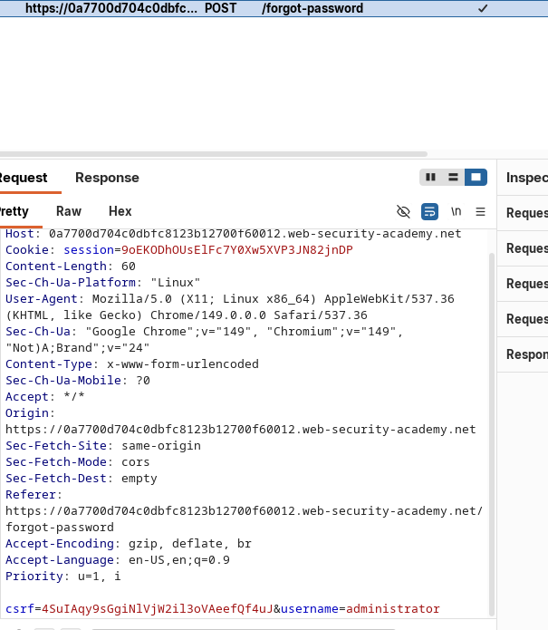

+++
title = 'API Testing'
date = '2026-08-22T07:41:26+05:45'
draft = false
tags = []
featureimage = 'first.jpg'
+++


## API Documentation:

It is often publicly available particularly if API is intended for use by external developers. If this is the case, always start recon from the documentation.

If API documentation is not publicly available:

→ Use Burp scanner to crawl the API possible endpoints.

→`/api`

→`/swagger/index.html`

→ `/openapi.json` 

---

### LAB: EXPLOITING AN API ENDPOINT USING DOCUMENTATION:

[Login](https://portswigger.net/web-security/learning-paths/api-testing/api-testing-api-documentation/api-testing/lab-exploiting-api-endpoint-using-documentation)

Got the documentation of API from `/api`  and when a logged in user tries to update the email. Sniff the request and then changed method to delete and user path from wiener to carlos and the lab was solved. 

---

## Machine-readable documentation:

Automated tools to look for documentations:

- Burp Scanner
- OpenAPI Parser BApp
- Postman
- Soaplit

---

## Identifying API endpoints:

- Identify endpoint
- Interact with endpoint and observe error which might load to construction of valid http request.
- Identify supported http method.

---

## HTTP Request Methods:

### Get Method:

Retrieves data from a resource. The get request is a representation of the specified resource. Request using GET should only retrieve data and should not contain request content.

### HEAD Method:

The head method asks for a response identical to a get requests, but without a response body.

### POST Method:

The post methods submits on entire to the specified resource often causing a change in state or side effect on the server.

### PUT Method:

The put requests method replaces all current representation of the target resource with the request content.

### DELETE Method:

The delete method deletes the specified resources.

### CONNECT Method:

It establishes a tunnel to the server identified by the target resource.

### OPTIONS Method:

It describes the communication options for the target resources.

### TRACE Method:

It performs a message loop back test along the path to the target resources.

### PATCH Method:

It applies partial modifications to a resource.

---

### LAB: FINDING AND EXPLOITING AN UNUSED API ENDPOINT:

[Login](https://portswigger.net/web-security/learning-paths/api-testing/api-testing-identifying-and-interacting-with-api-endpoints/api-testing/lab-exploiting-unused-api-endpoint)

First find the endpoint `/api/product/1/price` then change get method to options method and error says options not allowed, it suggests patch and content -type header error so add `content-type: application/file` and the add `{}` it returns error price parameter missing so then using that create `{”price”:0}` then order from the browser.

---

## Mass Assignment Vulnerabilities:

Mass assignment (also known as auto-binding) can inadvertently create hidden parameters. It occurs when software framework automatically bind request parameters to fields on an internal objects.

---

### LAB: EXPLOITING A MASS ASSIGNMENT VULNERABILITY:

[Login](https://portswigger.net/web-security/learning-paths/api-testing/api-testing-mass-assignment-vulnerabilities/api-testing/lab-exploiting-mass-assignment-vulnerability)

When doing the checkout the last post contains a object and while doing a simple change to a object like adding chosen-discount `{”percentage”: 0}` . It didn’t gave error so changed 0 to 100 then the lab was solved.

---

## Preventing vulnerabilities in API’s:

- Secure your documentation if you don’t intend your API to be publicly available.
- Ensure your documentation is kept up to date so that legitimate testers have full visibility of the API’s attack surface.
- Apply an allow list of permitted HTTP method.
- Validate that the content type is expected for each request or response.
- Use generic error message to avoid giving away information that may be useful for an attacker.
- Use protective measures on all version of your API,  not just the current prod version.

---

## Server Side Parameter Pollution:

Some of the internal APIs aren’t directly accessible from the Internet. Server Side Parameter Pollution occurs when a websites embeds user input in the server side request to an internal API without proper encoding. This leads to the manipulation or injection of parameters.

Also called as HTTP parameter pollution. However this term is also used for firewall (WAF) bypass technique. 

### Server Side Parameter Pollution in Query String:

Check by placing query syntax like `#`, `&`, and `=`  in input and observe how the application responds.

For Example:

A vulnerable web application that lets to search user based on their username.

When username is searched then the following request is sent;

`GET /userSearch?name=peter&back=/home`

To retrieve user information, server queries internal api with the following request:

`GET /users/search?name=peter&publicProfile=true` 

### Truncating query strings:

You can use a URL-encoded `#` character to attempt to truncate the server-side request. It's essential that you URL-encode the `#` character. Otherwise the front-end application will interpret it as a fragment identifier and it won't be passed to the internal API.

### Injecting invalid parameters:

`&` can be used to attempt to add a second parameter but the important thing is it that it needs to be URL encoded i.e. `%26` 

### Injecting valid parameters:

If modification on the query string is successful then second valid parameter to the server-side request can be done. 

For example, if you've identified the email parameter, you could add it to the query string as follows:

`GET /userSearch?name=peter%26email=foo&back=/home` 

### Overriding existing parameters:

For the confirmation of the server side parameter pollution, override the original parameter can be done.

For example, the string can be modified to the following query;

`GET /userSearch?name=peter%26name=carlos&back=/home` 

The internal API interprets two name parameters. The impact of this depends on how the application processes the second parameter. This varies across different web technologies. For example:

PHP parses the last parameter only. This would result in a user search for `carlos`.
[ASP.NET](http://asp.net/) combines both parameters. This would result in a user search for `peter,carlos`, which might result in an `Invalid username`error message.
Node.js / express parses the first parameter only. This would result in a user search for `peter`, giving an unchanged result.

If able to override the original parameter then there might be the chance of exploitation of this. For example, `name=administrator` to the request which might log in with admin privileges.

### LAB: EXPLOITING SERVER-SIDE PARAMETER POLLUTION IN A QUERY STRING:

[](https://portswigger.net/web-security/learning-paths/api-testing/api-testing-testing-for-server-side-parameter-pollution-in-the-query-string/api-testing/server-side-parameter-pollution/lab-exploiting-server-side-parameter-pollution-in-query-string#)

In the login page there is forget-password field which might be vulnerable to server-side parameter this is a total guess.

This is the request we are looking for:



Send this request to the Repeater:

when changed to `&username=administrator%23` 

the error message is shown which gives us the more boarder picture:


So from this we know to add field and then in the field we use intruder to brute force the parameter to check if is it vulnerable to server side parameter pollution.

Send the same request to the intruder to brute force the field:


and use the server side variable name list to fuzz this.


We found that field returns the data which is vulnerable to the server side parameter pollution.

While wandering to the site of the lab i found `forgetPassword.js`

In `forgetPassword.js` i found a exciting variable i.e. 
`reset_token` 

Again go to the repeater for the same request.

Note: The Session might expire resulting in internal server error i.e. `500` 


So with this token we will be able to reset the password and login with adminstrator credentials and delete the carlos user.


---

### Testing Server-Side Parameter Pollution in REST Path:

A RESTful API may place parameter names and values in the URL path, rather than the query string. For example, consider the following path:

```php
/api/users/123
```

The URL path might be broken down as follows:

- `/api` is the root API endpoint.
- `/users` represents a resource, in this case `users`.
- `/123`represents a parameter, here an identifier for the specific user.

Consider an application that enables you to edit user profiles based on their username. Requests are sent to the following endpoint:

```php
GET /edit_profile.php?name=peter
```

This results in the following server-side request:

```php
GET /api/private/users/peter
```

### Testing For Server-Side Parameter Pollution in Structured Data Format:

An attacker may be able to manipulate parameter to exploit vulnerabilities in the server’s processing of other structured data formats such as a JSON or XML.

To test this thing you can just inject unexpected structured data into user input and see how the server responds.

Consider an application that enables users to edit their profile, then applies their changes with a request to a server-side API. When you edit your name, your browser makes the following request:

```php
POST /myaccount
name=peter
```

This results in the following server-side request:

```php
PATCH /users/7312/update
{"name":"peter"}
```

You can attempt to add the `access_level` parameter to the request as follows:

```php
POST /myaccount
name=peter","access_level":"administrator
```

If the user input is added to the server-side JSON data without adequate validation or sanitization, this results in the following server-side request:

```php
PATCH /users/7312/update
{"name":"peter","access_level":"administrator"}
```

This may result in the user `peter` being given administrator access.

For example same thing in JSON data looks like the following:

```php
POST /myaccount
{"name": "peter"}
```

This results in the following server-side request:

```php
PATCH /users/7312/update
{"name":"peter"}
```

You can attempt to add the `access_level` parameter to the request as follows:

```php
POST /myaccount
{"name": "peter\",\"access_level\":\"administrator"}
```

If the user input is decoded, then added to the server-side JSON data without adequate encoding, this results in the following server-side request:

```php
PATCH /users/7312/update
{"name":"peter","access_level":"administrator"}
```

Again, this may result in the user `peter` being given administrator access.

<aside>
💡

Note: Server-side parameter pollution can occur in any structured format not only `XML` and `JSON`. 

</aside>

### Testing with automated tools:

Burp includes automated tools that can help you detect server-side parameter pollution vulnerabilities.

Burp Scanner automatically detects suspicious input transformations when performing an audit. These occur when an application receives user input, transforms it in some way, then performs further processing on the result.

You can also use the Backslash Powered Scanner BApp to identify server-side injection vulnerabilities. The scanner classifies inputs as boring, interesting, or vulnerable. You'll need to investigate interesting inputs using the manual techniques outlined above.

### Preventing server-side parameter pollution:

To prevent server-side parameter pollution, use an allowlist to define characters that don't need encoding, and make sure all other user input is encoded before it's included in a server-side request. You should also make sure that all input adheres to the expected format and structure.

---