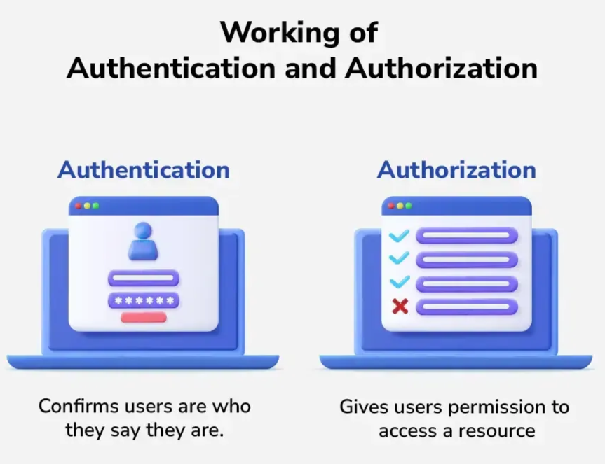
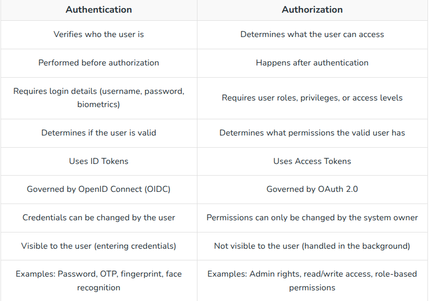

+++
title = 'Broken Access Control'
date = '2026-08-21T16:26:49+05:45'
draft = false
tags = []
featureimage = 'babal.jpeg'
+++


March 26, 2026 

## When authorization fails

## Introduction:

<aside>

What if changing a single number in a URL gave you access to someone else’s account?

</aside>

### Why it matters:

This is a real world scenario this happened globally many times with most of  reputed companies and their products.

### Context:

This blog is a walk-through of Broken Access Control Vulnerability which is the top most vulnerability in OWASP TOP-10. It goes through the basic concept of Broken Access Control and its different types. This includes many labs from portswigger and TryHackMe.

### What readers will learn:

1. Broken Access Control
2. Authentication and Authorization
3. Insecure Direct Object Reference (IDOR)
4. Privileged Escalation and their types
5. Prevention of Broken Access Control
6. Hands On Labs of Portswigger and TryHackMe

## Authentication VS Authorization:



**Authentication** is the process of verifying the identity of a user or system. It ensures that the user is legitimate by validating credentials like passwords, OTPs, or biometrics

**Working:**

- User enters credentials (password, OTP, biometrics)
- System verifies the credentials
- If valid, the user is successfully authenticated

**Authorization** determines the access rights and permissions of an authenticated user. It decides what resources the user can access and what actions they are allowed to perform.

**Working:**

- System checks the user’s roles or permissions.
- Grants or denies access to resources.
- Ensures the user can perform only allowed actions.

### Difference Between Authentication and Authorization:



<aside>

Broken Access Control happens when authorization fails.

</aside>

## Broken Access Control

Broken Access Control vulnerability occurs when the user can perform actions outside of their intended permissions. For example: When a normal customer gets to change the price of goods in a e-commerce website, this function should be extremely limited to the admin only.

### Moveit:

In 2023, a zero-day [vulnerability in MOVEit Transfer](https://www.invicti.com/blog/web-security/moveit-transfer-sql-injection-global-data-breaches/) (CVE-2023-34362) was exploited by the Cl0p ransomware group. The underlying flaw was [SQL injection](https://www.acunetix.com/websitesecurity/sql-injection/), but it was the lack of authentication on a critical endpoint that allowed attackers to reach and exploit it.

This combination of a technical vulnerability and broken access control enabled the compromise of over 2,000 organizations and the data of more than 62 million individuals. (Source: [TechCrunch](https://techcrunch.com/2023/08/25/moveit-mass-hack-by-the-numbers/))

### Why it happens?

- Server trusts client input.
- Missing checks.
- Lack of robust validation.

### Impact of Broken Access Control:

- Data exposure
- Unauthorized actions

### OWASP Top 10 (2025)


The OWASP Top 10 is a standard awareness document from the Open Web Application Security Project (OWASP) that represents a broad consensus on the most critical security risks to web applications.

A01:2025 - Broken Access Control maintains its position at #1 as the most serious application security risk; the contributed data indicates that on average, 3.73% of applications tested had one or more of the 40 Common Weakness Enumerations (CWEs) in this category. As indicated by the dashed line in the above figure, Server-Side Request Forgery (SSRF) has been rolled into this category.

### Why is it critical?

Broken Access control is critical vulnerability due to it being very common in many web applications and it is very easy to exploit. This low work high reward vulnerability.

## Core Vulnerabilities of Broken Access Control:

- **IDOR:** Insecure Direct Object Reference (IDOR) is a type of access control vulnerability occurring when an application uses user-supplied input to access objects directly (e.g., database keys, files) without proper authorization checks.
- **URL and Parameter Manipulation:** URL and parameter manipulation involves altering key-value pairs in a website's address (URL query strings) or form data to modify application behavior, bypass security controls, or gain unauthorized access.
- **Access Control Flaws in Multi-Step Process:** Access control flaws in multi-step processes occur when an application implements strict security checks on the initial steps of a workflow but fails to validate authorization on subsequent, intermediate, or final steps.
- **Over- Privileged Accounts and Weak Role Assignments:**  It occurs when users or systems are granted more permissions than necessary for their job functions (over-provisioning) or when roles are improperly designed, leading to unnecessary access.

## Insecure Direct Object Reference (IDOR):


Insecure direct object references (IDOR) are a type of access control vulnerability that arises when an application uses user-supplied input to access objects directly. The term IDOR was popularized by its appearance in the OWASP 2007 Top Ten. 

Consider a website that uses the following URL to access the customer account page, by retrieving information from the back-end database:

```jsx
https://insecure-website.com/customer_account?customer_number=132355
```

Here, the customer number is used directly as a record index in queries that are performed on the back-end database. If no other controls are in place, an attacker can simply modify the `customer_number` value, bypassing access controls to view the records of other customers. This is an example of an IDOR vulnerability leading to horizontal privilege escalation.

An attacker might be able to perform horizontal and vertical privilege escalation by altering the user to one with additional privileges while bypassing access controls. Other possibilities include exploiting password leakage or modifying parameters once the attacker has landed in the user's accounts page, for example

Now lets do a hands on lab to learn Basic IDOR:

[Lab: Insecure direct object references | Web Security Academy](https://portswigger.net/web-security/access-control/lab-insecure-direct-object-references)

### Write-up:

Go to the homepage and live chat and then go to download transcript and then look at burp http history then the send the request to the repeater. Change 2.txt to 1.txt and then the password of the carlos is shown.


```jsx
username: carlos
password: y2yctj1j9qei482jxlrp
```

## Privilege Escalation:

A privilege escalation attack is a type of cyber attack in which an attacker gains unauthorized access to elevated rights, permissions, entitlements, or privileges beyond those originally assigned to a user, account, identity, or machine.

### Aim of Privilege Escalation:

When we exploit a machine, we usually land as:

- **Normal / Restricted User:** Very limited actions
- **Administrator (Windows) / Sudo User (Linux):** Higher privilege but still not ultimate.

Our goal is to escalate further to System (Windows) or root (Linux)

- **NT AUTHORITY/SYSTEM:** the most powerful account in Windows (even more than Admin).
- **root:** the superuser in Linux with total control over files, processes, and users.

### Types of Privilege Escalation:

#### Vertical Privilege Escalation:

An attacker can exploit vertical privilege escalation to elevate access from a standard user account to higher-level privileges, such as those of an administrator or superuser. This escalation grants the attacker unrestricted control over the system, enabling them to modify critical configurations, install unauthorized software, create new privileged user accounts, and even delete or manipulate essential data. Such access can severely compromise system integrity, security, and availability


At its most basic, vertical privilege escalation arises where an application does not enforce any protection for sensitive functionality. For example, administrative functions might be linked from an administrator's welcome page but not from a user's welcome page. However, a user might be able to access the administrative functions by browsing to the relevant admin URL.

For example, a website might host sensitive functionality at the following URL:

```jsx
https://www.kastra.com/admin
```

This might be accessible by any user, not only administrative users who have a link to the functionality in their user interface. In some cases, the administrative URL might be disclosed in other locations, such as the `robots.txt` file:

```jsx
https://www.kastra.com/robots.txt
```

Even if the URL isn't disclosed anywhere, an attacker may be able to use a word list to brute-force the location of the sensitive functionality.

Now lets do a hands on lab on vertical privilege escalation:

[Lab: Unprotected admin functionality | Web Security Academy](https://portswigger.net/web-security/access-control/lab-unprotected-admin-functionality)

#### Write-up

- Go to lab and go to `robots.txt` and evaluate.

```jsx
https://0ae900dd03cd41fb839c969800b400c0.web-security-academy.net/robots.txt
```


Here the `robots.txt`  leaks the information about `/adminstrator-panel` 

Check the `/adminstrator-panel`  and delete Carlos to solve the lab

```jsx
https://0ae900dd03cd41fb839c969800b400c0.web-security-academy.net/administrator-panel
```


#### Horizontal Privilege Escalation:


Horizontal privilege escalation is when an attacker doesn’t become an admin but instead sneaks into another user’s account at the same privilege level, letting them see or use data and resources they shouldn’t normally have access to.

Lets learn through an example:

Imagine an online banking system where users can view their account details at this URL:

```jsx
https://nbank.com/account?u_id=10
```

If a attacker changes the url and he can view the details of other user just like this:

```jsx
https://nbank.com/account?u_id=11
```

and is able to view another customer's account data without any authentication or authorization checks.

Now lets do a hands on lab on horizontal privilege escalation:

[Lab: User ID controlled by request parameter | Web Security Academy](https://portswigger.net/web-security/access-control/lab-user-id-controlled-by-request-parameter)

#### Write up

- Login with the credential

```jsx
username: wiener
password: peter
```

- Go to my accounts and analyze the URL

```jsx
https://0a3300d903c02c33803cbc2e00f0004a.web-security-academy.net/my-account?id=wiener
```

- Change the id to carlos to retrieve the API key

```jsx
https://0a3300d903c02c33803cbc2e00f0004a.web-security-academy.net/my-account?id=carlos
```

Then the submit the carlos API key to solve the lab:

```jsx
API_KEY_OF_CARLOS: W1jXeDvyr7Ro7vNMX4j2xVdQ52JC3mSP
```

### Common Methods of Privilege Escalation:

This is essentially a list of common methods or attack vectors for privilege escalation in cyber security. It explains how attackers use technical flaws, user mistakes, or system weaknesses to move from limited access to higher-level privileges (like admin or root).


1. **Social Engineering:**
    
    Attackers manipulate or trick users into revealing sensitive information like passwords or performing actions that grant access. Common methods include phishing emails that impersonate trusted sources to steal credentials, allowing attackers to escalate privileges.
    
2. **Pass-the-Hash / Rainbow Table Attacks:**
    
    Instead of cracking passwords, attackers use stolen password hashes to authenticate and impersonate users on the network. This bypasses password entry and can give access to sensitive systems if proper protections aren’t in place.
    
3. **Vulnerabilities and Exploits:**
    
    Attackers exploit software bugs, unpatched vulnerabilities, or buffer overflows to execute malicious code with higher privileges. These flaws allow attackers to bypass normal security controls and gain elevated system access.
    
4. **Misconfigurations:**
    
    Improperly set permissions, weak passwords, or exposed services create opportunities for attackers to escalate privileges. For example, an unsecured open port or excessive user permissions can be exploited to gain higher access.
    
5. **Kernel Exploits:**
    
    Attackers exploit vulnerabilities in the operating system kernel, the core component controlling hardware and processes. Since the kernel runs with the highest privileges, these exploits can give attackers full control of the system, bypassing all security measures.
    

## Final Challenge

Lets do a final tryhackme challenge to test the knowledge gained during this session:

[Corridor](https://tryhackme.com/room/corridor)

### Write-up:

Check the door and open them and notice that their url is something like this

```jsx
http://10.48.145.11/c4ca4238a0b923820dcc509a6f75849b
```

This is something lets find out what is this 

To find which encryption it is go to the following site:

```jsx
https://hashes.com/en/tools/hash_identifier
```

By the analysis we found it is MD5 encryption

Let’s check 0 and its MD5 value 

```jsx
http://10.48.145.11/cfcd208495d565ef66e7dff9f98764da
```

Then we found the flag:


## Prevention of Broken Access Control:

Access control vulnerabilities can be prevented by taking a defense-in-depth approach and applying the following principles:

- Never rely on obfuscation alone for access control.
- Unless a resource is intended to be publicly accessible, deny access by default.
- Wherever possible, use a single application-wide mechanism for enforcing access controls.
- At the code level, make it mandatory for developers to declare the access that is allowed for each resource, and deny access by default.
- Thoroughly audit and test access controls to ensure they work as designed.

## Conclusion:

<aside>

So, What did we learn?

</aside>

Apparently, some applications still believe that users are *honest human beings* who would never try changing a parameter in a URL. Because obviously, if a button isn’t visible, no one will ever find the endpoint… right?

Broken Access Control is less about complex hacking and more about simple curiosity:

> “What happens if I change this?”
> 

And unfortunately, in many real-world applications, the answer is:

> “You now have access to things you absolutely shouldn’t.”
> 

From IDOR to privilege escalation, the pattern is clear.
the server trusted the client a little too much… and the client betrayed that trust immediately.

The takeaway is simple:

- If the server doesn’t enforce authorization, attackers will.
- If access control is weak, everything else becomes irrelevant.

So next time you see a parameter like `user_id=101`,

just remember — someone, somewhere, forgot to check it.

And that’s all it takes.

<aside>

Sayonara! Adios!!

</aside>