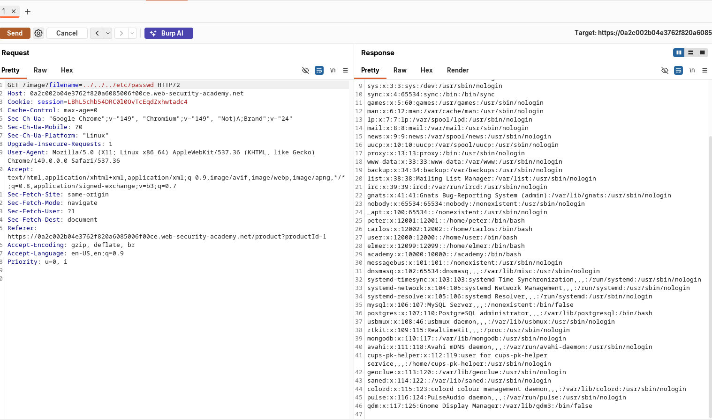

+++
title = 'Path Traversal'
date = '2026-08-22T07:43:48+05:45'
draft = false
tags = []
featureimage = 'path.png'
+++


Path Traversal is also known as directory traversal. These vulnerabilities enable an attacker to read arbitrary files on the server. In some cases attacker might be able to write to arbitrary files on the server allowing attacker to modify application data or behavior and take full control of the server.

---

## Reading arbitrary files via path traversal:

Imagine a shopping application that displays images of items for sale. This might load an image using the following HTML:

```html

```

The `loadImage` URL takes a `filename` parameter and returns the contents of the specified file. The image files are stored on disk in the location `/var/www/images/`. To return an image, the application appends the requested filename to this base directory and uses a filesystem API to read the contents of the file. In other words, the application reads from the following file path:

```php
/var/www/images/218.png
```

This application implements no defenses against path traversal attacks. As a result, an attacker can request the following URL to retrieve the `/etc/passwd` file from the server's filesystem:

```php
https://insecure-website.com/loadImage?filename=../../../etc/passwd
```

This causes the application to read from the following file path:

```php
/var/www/images/../../../etc/passwd
```

The sequence `../` is valid within a file path, and means to step up one level in the directory structure. The three consecutive `../` sequences step up from `/var/www/images/` to the filesystem root, and so the file that is actually read is:

```php
/etc/passwd
```

On Unix-based operating systems, this is a standard file containing details of the users that are registered on the server, but an attacker could retrieve other arbitrary files using the same technique.

On Windows, both `../` and `..\` are valid directory traversal sequences. The following is an example of an equivalent attack against a Windows-based server:

```php
https://insecure-website.com/loadImage?filename=..\..\..\windows\win.ini
```

---

### LAB: FILE PATH TRAVERSAL, SIMPLE CASE:

[](https://portswigger.net/web-security/learning-paths/path-traversal/reading-arbitrary-files-via-path-traversal/file-path-traversal/lab-simple)

This is a simple path traversal vulnerability in product image view function. This kind of basic vulnerability will not occur in modern web application. 



---

## **Common obstacles to exploiting path traversal vulnerabilities:**

Many applications that place user input into file paths implement defenses against path traversal attacks. These can often be bypassed.

If an application strips or blocks directory traversal sequences from the user-supplied filename, it might be possible to bypass the defense using a variety of techniques.

You might be able to use an absolute path from the filesystem root, such as `filename=/etc/passwd`, to directly reference a file without using any traversal sequences.

---

### LAB: FILE PATH TRAVERSAL, TRAVERSAL SEQUENCES BLOCKED WITH ABSOLUTE PATH BYPASS:

[](https://portswigger.net/web-security/learning-paths/path-traversal/common-obstacles-to-exploiting-path-traversal-vulnerabilities/file-path-traversal/lab-absolute-path-bypass)

This lab contains a path traversal vulnerability in the display of product images.

The application blocks traversal sequences but treats the supplied filename as being relative to a default working directory.

To solve the lab, retrieve the contents of the `/etc/passwd` file.

This Lab flags `../../../` ans says no file found so when we give `/etc/passwd` the lab is solved.


---

Some applications try to block path traversal by **stripping out** the literal sequence `../` (or `..\` on Windows) wherever it appears in the input — rather than rejecting the input outright, they just delete that substring and process what's left.

You might be able to use nested traversal sequences, such as `....//` or `....\/`. These revert to simple traversal sequences when the inner sequence is stripped.

for example:

`….//` if the application strips `../` from the middle then the remaining will still work.

---

### LAB: FILE PATH TRAVERSAL, TRAVERSAL SEQUENCES STRIPPED NON-RECURSIVELY:

[](https://portswigger.net/web-security/learning-paths/path-traversal/common-obstacles-to-exploiting-path-traversal-vulnerabilities/file-path-traversal/lab-sequences-stripped-non-recursively)


---

In some contexts, such as in a URL path or the `filename` parameter of a `multipart/form-data` request, web servers may strip any directory traversal sequences before passing your input to the application. You can sometimes bypass this kind of sanitization by URL encoding, or even double URL encoding, the `../` characters. This results in `%2e%2e%2f` and `%252e%252e%252f` respectively. Various non-standard encodings, such as `..%c0%af` or `..%ef%bc%8f`, may also work.

Burp Intruder provides the predefined payload list **Fuzzing - path traversal**. {For Professional Version Users}

---

### LAB: FILE PATH TRAVERSAL, TRAVERSAL SEQUENCES STRIPPED WITH SUPERFLUOUS URL-DECODE.

[](https://portswigger.net/web-security/learning-paths/path-traversal/common-obstacles-to-exploiting-path-traversal-vulnerabilities/file-path-traversal/lab-superfluous-url-decode)

This lab contains a path traversal vulnerability in the display of product images.

The application blocks input containing path traversal sequences. It then performs a URL-decode of the input before using it.

To solve the lab, retrieve the contents of the `/etc/passwd` file.


---

An application may require the user-supplied filename to start with the expected base folder, such as `/var/www/images`. In this case, it might be possible to include the required base folder followed by suitable traversal sequences. For example: `filename=/var/www/images/../../../etc/passwd`.

---

### LAB: FILE PATH TRAVERSAL, VALIDATION OF START OF THE PATH:

[](https://portswigger.net/web-security/learning-paths/path-traversal/common-obstacles-to-exploiting-path-traversal-vulnerabilities/file-path-traversal/lab-validate-start-of-path)

This lab contains a path traversal vulnerability in the display of product images.

The application transmits the full file path via a request parameter, and validates that the supplied path starts with the expected folder.

To solve the lab, retrieve the contents of the `/etc/passwd` file.


---

An application may require the user-supplied filename to end with an expected file extension, such as `.png`. In this case, it might be possible to use a null byte to effectively terminate the file path before the required extension. For example: `filename=../../../etc/passwd%00.png`.

### LAB: FILE PATH TRAVERSAL, VALIDATION OF FILE EXTENSION WITH NULL BYTE:

[](https://portswigger.net/web-security/learning-paths/path-traversal/common-obstacles-to-exploiting-path-traversal-vulnerabilities/file-path-traversal/lab-validate-file-extension-null-byte-bypass)

This lab contains a path traversal vulnerability in the display of product images.

The application validates that the supplied filename ends with the expected file extension.

To solve the lab, retrieve the contents of the `/etc/passwd` file.


**Null byte** (`%00` / `0x00`) — a character that means "end of string" in C and other null-terminated string languages.

**Why it matters for traversal attacks:** App checks the full filename (e.g. `../../etc/passwd%00.png`) and sees it ends in `.png` → passes the filter. But the underlying file-system call (often C-based) stops reading at `%00`, so it actually opens `../../etc/passwd` — extension check bypassed.

**Note:** Doesn't work on modern Java/PHP/etc. since they use length-prefixed strings, not null-terminated ones — only affects code that hands the string to native/C-level file APIs.

---

## How to prevent a path traversal attack:

The most effective way to prevent path traversal vulnerabilities is to avoid passing user-supplied input to filesystem APIs altogether. Many application functions that do this can be rewritten to deliver the same behavior in a safer way.

If you can't avoid passing user-supplied input to filesystem APIs, we recommend using two layers of defense to prevent attacks:

- Validate the user input before processing it. Ideally, compare the user input with a whitelist of permitted values. If that isn't possible, verify that the input contains only permitted content, such as alphanumeric characters only.
- After validating the supplied input, append the input to the base directory and use a platform filesystem API to canonicalize the path. Verify that the canonicalized path starts with the expected base directory.

Below is an example of some simple Java code to validate the canonical path of a file based on user input:

```java
File file = new File(BASE_DIRECTORY, userInput);
if (file.getCanonicalPath().startsWith(BASE_DIRECTORY)) {
    // process file
}
```

---